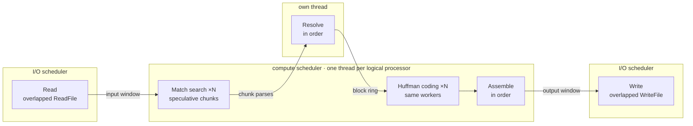

# ctDeflate: gzip, bit for bit, one file on many cores

**ctDeflate** is a gzip compressor for Windows x64 that writes *exactly* the same `.gz` files as `gzip` from **libdeflate 1.26** (compression levels 1 to 9), byte for byte, and spreads the compression of a **single file** over all cores. It is a hand-written C++ port of libdeflate's compressor, built on **ThinkMeta.ConcurrentTasks**, a fiber-based task scheduler for Windows.

The parallelization and optimizations were done **AI-assisted**, using ThinkMeta.ConcurrentTasks: AI coding agents wrote, measured and tuned the code under the direction of ThinkMeta's developers, and every step was checked byte for byte against the reference.

| i9-11900K, 16 threads | enwik9 (1 GB, one file) | | | Silesia corpus (12 files, 212 MB) | | |
|---|---:|---:|---:|---:|---:|---:|
| | gzip.exe | **ctDeflate** | factor | gzip.exe | **ctDeflate** | factor |
| level 1 | 217 MB/s | **928 MB/s** | **4.3×** | 213 MB/s | **516 MB/s** | **2.4×** |
| level 6 (default) | 106 MB/s | **392 MB/s** | **3.7×** | 115 MB/s | **254 MB/s** | **2.2×** |
| level 9 | 61 MB/s | **303 MB/s** | **4.9×** | 47 MB/s | **170 MB/s** | **3.6×** |

*Wall time of the whole program run including file I/O, median of 3, every output bit-identical to `gzip.exe` (the official libdeflate 1.26 build). Details, all files and more CPUs under [Benchmarks](#benchmarks).*

---

## Repository contents

| Folder / file | Contents |
|---|---|
| `bin\` | `ctDeflate.exe` (the compressor), `gzip.exe` (the reference: the official libdeflate 1.26 Windows x64 release build), `ThinkMeta.ConcurrentTasks.Core.dll` (scheduler core) |
| `libdeflate\` | The libdeflate 1.26 sources with Visual Studio projects for the library and `gzip.exe` |
| `libdeflate.slnx` | Builds `gzip.exe` from these sources with Visual C++ (Visual Studio 2026, x64; output in `libdeflate\build\Release\bin`) |
| `benchmark\` | `Compare-Gzip.ps1` and `run.cmd`: speed and bit identity on your own files |
| `New-BenchPackage.ps1` | Packs `bin\` and the benchmark into a zip for other PCs |

More on the reference under [The reference](#the-reference).

---

## Try it

No installation and no runtime to install: `ctDeflate.exe` is linked with the static C runtime and needs nothing but Windows and the scheduler core next to it.

| | |
|---|---|
| System | Windows 10 or 11, or Windows Server 2016 or later, x64 |
| CPU | x64 with AVX2, FMA, BMI2 and PCLMUL (Intel since Haswell, 2013; AMD since Excavator and all Zen). ctDeflate checks this at start, before any of its other code runs; on an older CPU it names the missing instruction sets and exits with code 3 |
| `gzip.exe` | the official libdeflate build uses the Universal C Runtime, which is part of Windows 10 and Server 2016 and later |

```cmd
copy input.bin a.bin
copy input.bin b.bin
bin\gzip -6 a.bin
bin\ctDeflate -6 b.bin
fc /b a.bin.gz b.bin.gz
```

`fc /b` finds no differences. (`gzip` replaces `a.bin` by `a.bin.gz`; `ctDeflate` writes `b.bin.gz` and keeps `b.bin`. All options under [Command line](#command-line).)

### Benchmark on your own files

```cmd
benchmark\run.cmd "D:\Data\big.bin" "D:\Logs"
benchmark\run.cmd "D:\Logs" -Recurse -Levels 1,6,9 -Rounds 5
```

The script compresses every file with gzip.exe and ctDeflate at every level, measures the wall time of each run and checks that every output is identical. It switches to the High Performance power plan during the run (or a temporary copy where the plan is hidden) and restores the previous plan afterwards; if Windows refuses the switch, for example on Windows Server without administrator rights, the report says so and the run goes on with the current plan (`-KeepPowerPlan` leaves the plan alone). The script runs on Windows PowerShell 5.1 and later. Report and CSV go to `benchmark\results\`; the report ends with whether the previous power plan was restored. Exit code of the script and of `run.cmd`: 0 if every output was identical, 2 if at least one differed or a run failed, 1 for other errors (a missing program, wrong parameters, a CPU ctDeflate does not run on, an abort), checked before the power plan is switched where possible. `New-BenchPackage.ps1 -Corpus <folders>` packs the programs, the script and test files for other PCs; `run.cmd` without arguments then benchmarks those files. Results of your hardware are welcome.

---

## Benchmarks

<details>
<summary><b>Machines and method</b></summary>

* Main machine: Intel Core i9-11900K (8 cores, 16 threads), Windows 11, High Performance power plan. Further CPUs below.
* `benchmark\Compare-Gzip.ps1`: every file and level compressed by `gzip.exe` (libdeflate 1.26, one thread) and by ctDeflate (all logical processors), the programs interleaved round by round; measured is the wall time of the whole program run, including program start, reading the input and writing the `.gz`. Median of 3 runs. Every output is compared with `gzip.exe`'s byte for byte: 117 of 117 runs on the three machines were identical.
* These results were measured warm: each input was copied once and then read by both programs from the file cache. Since 2026-10-10 `Compare-Gzip.ps1` measures cold by default: before every run it writes a fresh copy of the input without the file cache (`robocopy /J`), so each program reads the file from the disk, as it would a file it has not seen before; the copy is not timed. `-Warm` gives the old method.

</details>

### Corpus

* **enwik9:** the first 10<sup>9</sup> bytes of the English Wikipedia XML dump, the test file of the [Large Text Compression Benchmark](http://mattmahoney.net/dc/textdata.html), one large file.
* **Silesia corpus:** 12 files of 5 to 51 MB, 212 MB in all (text, XML, databases, executables, images), the [usual corpus](https://sun.aei.polsl.pl/~sdeor/index.php?page=silesia) of compressor benchmarks.

`New-BenchPackage.ps1 -Corpus` packs them with the programs and the script; `run.cmd` without arguments then benchmarks them.

### Results per file and level

<details>
<summary><b>Per file</b>: the gain grows with the file size and the level</summary>

Intel Core i9-11900K, 16 threads, gzip.exe → ctDeflate:

| File | size | level 1 | level 6 | level 9 |
|---|---:|---:|---:|---:|
| enwik9 (Wikipedia XML text) | 1,000 MB | 217 → 928 MB/s (**4.3×**) | 106 → 392 MB/s (**3.7×**) | 61 → 303 MB/s (**4.9×**) |
| mozilla (tar of executables) | 51 MB | 218 → 668 MB/s (**3.1×**) | 119 → 354 MB/s (**3.0×**) | 38 → 208 MB/s (**5.5×**) |
| webster (dictionary text) | 41 MB | 238 → 668 MB/s (**2.8×**) | 111 → 346 MB/s (**3.1×**) | 47 → 226 MB/s (**4.8×**) |
| nci (chemical database) | 34 MB | 415 → 1,083 MB/s (**2.6×**) | 227 → 620 MB/s (**2.7×**) | 69 → 395 MB/s (**5.7×**) |
| samba (tar of source code) | 22 MB | 269 → 629 MB/s (**2.3×**) | 131 → 273 MB/s (**2.1×**) | 53 → 183 MB/s (**3.5×**) |
| dickens (English text) | 10 MB | 167 → 341 MB/s (**2.0×**) | 74 → 161 MB/s (**2.2×**) | 37 → 116 MB/s (**3.1×**) |
| osdb (MySQL database) | 10 MB | 187 → 429 MB/s (**2.3×**) | 117 → 251 MB/s (**2.1×**) | 99 → 232 MB/s (**2.3×**) |
| mr (MRI image) | 10 MB | 183 → 386 MB/s (**2.1×**) | 96 → 134 MB/s (**1.4×**) | 43 → 74 MB/s (**1.7×**) |
| x-ray (X-ray image) | 8 MB | 120 → 269 MB/s (**2.3×**) | 91 → 105 MB/s (**1.2×**) | 80 → 107 MB/s (**1.3×**) |
| sao (star catalog, binary) | 7 MB | 120 → 241 MB/s (**2.0×**) | 68 → 119 MB/s (**1.7×**) | 52 → 110 MB/s (**2.1×**) |
| reymont (Polish text, PDF) | 7 MB | 164 → 302 MB/s (**1.8×**) | 78 → 166 MB/s (**2.1×**) | 23 → 70 MB/s (**3.1×**) |
| ooffice (executable) | 6 MB | 113 → 248 MB/s (**2.2×**) | 78 → 124 MB/s (**1.6×**) | 50 → 96 MB/s (**1.9×**) |
| xml (XML files) | 5 MB | 174 → 285 MB/s (**1.6×**) | 131 → 194 MB/s (**1.5×**) | 65 → 126 MB/s (**2.0×**) |

The gain grows with the file size and the level. ctDeflate parses the input in 1 MiB chunks, so a file of 6 to 10 MB keeps only 6 to 10 of the 16 threads busy, and its run is partly program start and I/O. Level 9 spends the most time in the match search, the part that runs in parallel. `mr` (an MRI image) is the hard case at level 6: the minimum match length libdeflate chooses changes all the time there, and the resolver has to re-parse parts of the file on its own thread.

</details>

<!-- BENCHMARK: ctDeflate --sequential (one thread) per file and level, if wanted as a further column -->

### Other CPUs

Factor against gzip.exe on the same machine, all logical processors, same corpus and method:

| CPU | enwik9 level 1 | level 6 | level 9 | Silesia level 1 | level 6 | level 9 |
|---|---:|---:|---:|---:|---:|---:|
| Intel Core i9-11900K, 8 cores / 16 threads, Windows 11 | 4.3× | 3.7× | 4.9× | 2.4× | 2.2× | 3.6× |
| Intel Core Ultra 7 155H (notebook), 16 cores (6 performance, 10 efficiency) / 22 threads | 4.1× | 3.3× | 2.0× ² | 2.3× | 2.0× | 3.5× |
| Intel Xeon E3-1275 v6, 4 cores / 8 threads | 8.3× ¹ | 3.0× ¹ | 3.3× ¹ | 2.1× | 1.7× | 2.6× |

¹ On the Xeon machine `gzip.exe` compressed enwik9 at level 1 with only 48 MB/s, no faster than at level 6 (50 MB/s), while it reached 160 MB/s at level 1 on the Silesia files there and 200 to 217 MB/s on enwik9 on the other machines. So that run was limited by reading and writing the 1 GB file rather than by compression, and the enwik9 factors on the Xeon overstate the gain.
² On the Core Ultra notebook ctDeflate reached 301 MB/s on enwik9 at level 6 but only 100 MB/s at level 9, where the other machines gain most. Not yet explained; see Room for improvement.

### Threads

<!-- BENCHMARK: speed by number of threads for enwik9; the numbers below are from a file of our own and a build before the last parser change -->
Level 9, a 163 MB database file of our own: 1 / 2 / 4 / 8 / 12 / 16 threads give 38 / 69 / 137 / 252 / 341 / 380 MB/s. Up to 8 threads (one per core) the speed grows almost linearly (6.6×); the 8 extra hyperthreads add another 1.5×.

### Memory

ctDeflate reads and writes the files in streaming mode; only the chunks in flight are in memory. Peak working set with 16 threads, measured on files of our own:

| Input | level 1 | level 6 | level 9 |
|---|---:|---:|---:|
| database, 163 MB | 58 MB | 84 MB | 80 MB |
| the database 32 times, 5.2 GB | 78 MB | 144 MB | |

The 5.2 GB file takes 7.3 s at level 6 against 28.8 s for `gzip.exe` (4.0×), with the same output.

<!-- BENCHMARK: peak working set (ctDeflate -v) for enwik9 -->

---

## Why this is hard

Parallel gzip tools such as pigz cut the input into pieces and compress them independently: the result is valid gzip, but not the same bytes. ctDeflate may not do that. Its output has to be exactly libdeflate's, and libdeflate's compressor is sequential in three ways:

- **block boundaries:** libdeflate ends a block when the statistics of the symbols parsed since the block began change enough, so where a block ends depends on everything before it in the block;
- **the parse:** at levels 2 to 9 the minimum match length (3 to 9) is chosen from the first 4 KiB of each block and, at the lazy levels, recalculated from the block's literal counts as the parse goes on, and the match search sees the 32 KiB before every position, so the same position is parsed differently depending on where its block began;
- **the bit stream:** every block starts at the bit where the previous one ended, and whether a block is stored uncompressed depends on that bit offset.

ctDeflate keeps all of that exact and still runs the heavy part, the match search, in parallel:



**[How the graph grew, step by step →](docs/task-graph.md)** from libdeflate's single call to this
graph, with the reason and the measured gain of each step.

1. **Speculative chunk parses:** worker tasks parse 1 MiB chunks of the input in parallel, each as if a block started there, with libdeflate's matchfinder rebuilt from the 32 KiB before the chunk. Where the minimum match length is uncertain, a chunk follows several parse paths at once; they share the match searches and split only where the decision differs.
2. **Resolver:** one task replays libdeflate's block logic over the chunk parses in order. Where a chunk's parse meets the true parse (same position, same minimum match length) it takes over; where none does, the resolver re-parses exactly. The result is libdeflate's exact sequence of literals and matches and its exact block boundaries.
3. **Encode and stitch:** resolved blocks are Huffman-coded in parallel while the resolver goes on, and appended to the output in order; an uncompressed block is chosen by the actual bit offset, as libdeflate does.
4. **Streaming:** reading and writing are tasks of their own with overlapped file I/O on an I/O scheduler; only the chunks in flight are in memory (a 5.2 GB file compresses with less than 150 MB, enwik9 with 130 to 165 MB against 1.3 GB for `gzip.exe`).
5. **Bit identity:** every change is checked against the reference on a corpus of real files at all levels and with 1 to 16 threads.

---

## The reference

`bin\gzip.exe` is the gzip program of **libdeflate 1.26** from the project's official Windows x64 release (built with GCC/MinGW), SHA-256 `376e331df9da3b8aa465dd7aaa5139adc8c60d9a1dd528cfb0ddeee55d19aaec`. Every bit comparison and every benchmark in this README uses it.

`libdeflate\libdeflate-1.26\` holds the libdeflate sources (`lib\`, `programs\`); `libdeflate.slnx` builds the library and the same `gzip.exe` with Visual C++:

```
msbuild libdeflate.slnx /p:Configuration=Release /p:Platform=x64
```

The result, `libdeflate\build\Release\bin\gzip.exe`, writes the same files as the official build (checked at levels 1, 6 and 9).

What ctDeflate reproduces is the output of `libdeflate_gzip_compress()`, which `gzip.exe` writes: the gzip header without file name and with modification time 0, the DEFLATE stream of the chosen level, CRC-32 and size. libdeflate has the levels 0 to 12; ctDeflate implements 0 to 9 (`gzip.exe` itself starts at 1). The levels 10 to 12 use libdeflate's near-optimal parser and are not supported yet.

---

## Command line

```
ctDeflate [options] FILE
```

ctDeflate compresses one file to `FILE.gz` (or the file given with `-o`) and keeps the input.

| Option | Meaning |
|---|---|
| `-0` … `-9` | compression level, as in libdeflate; default `-6`. `-0` stores the data uncompressed, `-1` is the fastest, `-9` the strongest |
| `-o FILE` | output file; default: the input name plus `.gz`. An existing file is overwritten |
| `--threads n` | worker threads; default: all logical processors |
| `--sequential` | the plain port as one compressor task between asynchronous reading and writing (the single-threaded reference path, about 20 MB of memory for any file size) |
| `-v` | print sizes, time, speed, peak memory and the counters of the parallel pipeline (below) |

<details>
<summary><b>Options for tuning and diagnosis</b></summary>

| Option | Meaning |
|---|---|
| `--in-memory` | parallel, but read the whole file first and write the output at the end, instead of streaming |
| `--chunk n` | size of the speculative parse chunks in bytes; default 1048576 (1 MiB), at least 4096 |
| `--ahead n` | how many chunks the parses may run ahead of the resolver; default threads + 4. More can be a few percent faster and costs memory |
| `--repeat n` | compress n times (for profiling) |

</details>

Differences from `gzip.exe`:

| gzip.exe | ctDeflate |
|---|---|
| any number of files per call | one file per call |
| replaces the input by `FILE.gz` unless `-k` | always keeps the input |
| refuses to overwrite an existing `FILE.gz` unless `-f` | overwrites the output |
| `-c` (to standard output), reading from standard input | files only |
| `-d` (decompress, also as `gunzip`), `-t` (test) | compression only: decompress or test with `gzip.exe` |
| `-S SUF`, `-q`, `-V`, `-h` | not supported (`-o` instead of `-S`) |
| levels 1 to 12 | levels 0 to 9 |

The exit code is 0 on success, 1 on an error (unknown option, a file that cannot be read or written) and 3 if the CPU lacks an instruction set ctDeflate needs; after an error in the default streaming mode ctDeflate deletes the incomplete output.

<details>
<summary><b>Example of <code>-v</code></b></summary>

```
D:\silesia\dickens: 10192446 -> 3859454 bytes, 0.060 s, 170.9 MB/s, peak memory 66 MB
  chunks 10, blocks 46, syncs 9, repairs 8 (32701 bytes), max sync distance 22; parse+resolve 0.050 s (resolver waited 0.034 s), encode 0.001 s, stitch 0.000 s
  repairs by cause: minLen 6, parse ended 2; iterations by minLen: 3:6678/117KB 4:478/9816KB 5:2/19KB
```

The first line: input and output size, the time including reading and writing the files, the speed and the peak working set. The second: the chunks of the speculative parse, the deflate blocks written, how often the resolver took over a chunk's parse (syncs) and how often and over how many bytes it had to re-parse on its own (repairs), the time until the last block was resolved and how much of it the resolver waited for chunk parses. The third: why it re-parsed (the chunk had no parse path for the true minimum match length, or its paths ended), and per minimum match length the iterations the resolver checked one by one and the input they covered. With `--sequential` only the first line is printed.

</details>

---

## Room for improvement

ctDeflate is not finished; the measurements point to these next steps:

* **Serial parts at low levels:** one task replays libdeflate's block logic over the chunk parses, in order, and the file is read and written in order. At level 1 the parallel parse is so fast that these serial parts take most of the time.
* **Re-parsing where the minimum match length changes:** libdeflate chooses a minimum match length per block from the block's own data and adjusts it within the block. On data where it changes often (source code, logs, the MRI image of the Silesia corpus), a chunk follows several parse paths for the candidate values, and every extra path costs up to 20 % of parse speed; where none of them meets the true parse, the resolver re-parses on its own thread. A better prediction of the value at chunk starts would save both.
* **Per-thread overhead:** with one worker, the parallel pipeline was about 18 % slower than ctDeflate `--sequential` in our last measurement: every chunk rebuilds the matchfinder from the 32 KiB before it, parses 16 KiB past its end, and the paths need bookkeeping. Larger chunks or reusing the matchfinder across neighbouring chunks would reduce that.
* **Small files:** a file of 6 to 10 MB has only 6 to 10 chunks of 1 MiB, fewer than the threads of most CPUs; smaller chunks for small files would keep all threads busy. Below about 20 MB the program start and the file I/O also take a large share of the time, and the parse-path selection needs a few resolved chunks before it settles on one path.
* **Hybrid CPUs:** on the Core Ultra 7 155H (performance and efficiency cores) enwik9 at level 9 ran at a third of the level 6 speed, while the other machines gain most at level 9. Whether the scheduling of the parse tasks onto efficiency cores, power limits of the notebook or memory is the cause is still open.
* **Compiler:** the single-threaded match search runs at 92 to 100 % of libdeflate built with the same compiler (MSVC), but the official `gzip.exe` is built with GCC and is up to 10 % faster on one core.
* **Levels 10 to 12:** libdeflate's near-optimal parser carries its cost model from block to block, a serial chain; ctDeflate does not support these levels yet.
* **What did not work:** compressing chunks independently and concatenating them (as parallel gzip tools do) can never be bit-identical, because libdeflate's parse and block boundaries depend on everything before; choosing the parse paths only from the values of the last blocks caused many re-parses on databases. Both led to the speculative parse with an exact resolver.

Every step keeps the output bit-identical to libdeflate.

---

## ThinkMeta.ConcurrentTasks

`ctDeflate` is a showcase for **ThinkMeta.ConcurrentTasks**, a fiber-based task scheduler and concurrency runtime by ThinkMeta Software GmbH. Tasks run on lightweight user-mode fibers: a task waiting for a chunk, an event or I/O yields without blocking its worker thread, and a task switch costs a few hundred nanoseconds.

### Why fibers here

In ctDeflate the stages wait on each other all the time:
* The resolver waits for the parse of the next chunk.
* The workers wait for resolved blocks to encode.
* The reader and writer tasks wait for their asynchronous reads and writes through the I/O completion port, the reader also for room in the window of chunks in flight and the writer for finished output. Only those chunks are in memory, which is how a 5.2 GB file compresses with less than 150 MB.

On fibers each of these waits is a plain blocking call (`Wait()` on an event or a semaphore) in sequential code, and the worker thread meanwhile runs other parses and encodes. A thread pool would have to block one of its threads for each such wait, or split the resolver and the reader into callbacks that resume at every chunk boundary and every completed read.

👉 **Get in touch:** [www.thinkmeta.com](https://www.thinkmeta.com)

---

## License

* **libdeflate sources and `bin\gzip.exe`** (`libdeflate\`): MIT License, Copyright 2016 Eric Biggers and 2024 Google LLC ([`COPYING`](COPYING)).
* **ctDeflate binary** (`bin\ctDeflate.exe`): proprietary, Copyright (c) 2026 ThinkMeta Software GmbH, under the same provisional terms as the scheduler core ([`LICENSE-Core.txt`](LICENSE-Core.txt)): free for private and non-commercial use, commercial use requires a license from ThinkMeta Software GmbH. It contains code ported from libdeflate, whose MIT notice is in [`COPYING`](COPYING). The source code is planned to be published under the MIT License.
* **Scheduler core** (`bin\ThinkMeta.ConcurrentTasks.Core.dll`): proprietary, same terms ([`LICENSE-Core.txt`](LICENSE-Core.txt)).
* **Benchmark scripts** (`benchmark\`, `New-BenchPackage.ps1`): MIT License, Copyright (c) 2026 ThinkMeta Software GmbH ([`LICENSE.txt`](LICENSE.txt)).

**Benchmarks are explicitly permitted:** anyone may run benchmark tests of any kind with the programs in `bin\`, on any hardware and for any purpose, commercial evaluation included, and publish the results, including comparisons with other software, without asking ThinkMeta Software GmbH first (point 2 of [`LICENSE-Core.txt`](LICENSE-Core.txt)).
