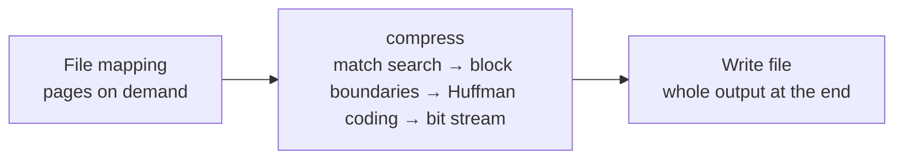
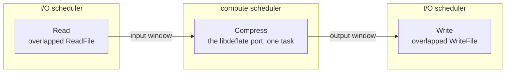
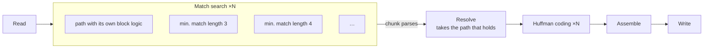
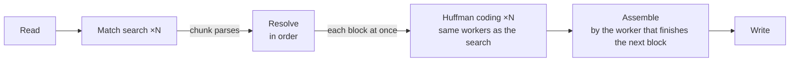

# How ctDeflate's task graph grew

ctDeflate did not start parallel. It started as a faithful port of libdeflate's compressor and was
taken apart step by step, each step measured and checked byte for byte against libdeflate's
`gzip`. This page shows the task graph after each step: what changed, why, and what it gave.

[← back to the README](../README.md)

**Three series of numbers.** Steps 2 to 6 were measured during development on an Intel Core
i9-11900K with 16 threads, on four files of our own (a 26 MB log, 12 MB of source code, a 163 MB
database, a 77 MB precompiled header); in steps 2 to 4 the whole file was in memory and only the
compression was timed ("in memory"), from step 5 on file to file. Steps 1 and 7 also show A/B
comparisons of 2026-10-10 on the same machine, as the wall time of the whole program. Step 7 shows
the published benchmark: the wall time of the whole program on enwik9 and the Silesia corpus. Only
numbers within one series compare.

| Shape | Meaning |
|---|---|
| box | a task |
| box ×N | one task per compute thread, all doing the same kind of work |
| frame | a scheduler: the I/O scheduler or the compute scheduler (one thread per logical processor) |
| arrow | an edge: the input, the chunk parses, the ring of blocks, the output |
| dotted arrow | feedback against the direction of the data |
| **in order** | a serial stage that takes its data in order |

| Term | Meaning |
|---|---|
| match search | finds the repeats in the data and decides literal or match; the expensive part |
| resolve | replays libdeflate's block logic in order and takes over the speculative searches that match |
| Huffman coding | builds each block's Huffman codes and bits |
| assemble | appends the coded blocks bit by bit, in order |

---

## 0 · The reference: libdeflate's gzip

One thread does everything in turn: it maps the file into its address space (the operating system
loads the parts it touches), compresses it in one call, and builds the whole output in memory before
it writes it. For enwik9 (1 GB) that is about 1.3 GB of memory: the pages read stay in memory, plus
the whole output.

libdeflate's compressor is sequential in three ways: where a block ends depends on the statistics of
everything since the block began; the minimum match length is chosen from the start of each block,
so the same position is parsed differently depending on where its block began; and every block
starts at the bit where the previous one ended. One core works, the others wait.

These bytes are the yardstick: every later step writes exactly the same `.gz` file.

---

## 1 · The port: one compressor task between asynchronous reading and writing

**Change:** libdeflate's compressor is rewritten in C++: match finders, greedy and lazy parsing,
block boundaries, Huffman coding, bit stream, CRC-32. Reading and writing become tasks with
overlapped I/O on an I/O scheduler of their own; the compressor is one task on the compute scheduler.
Before each block it tells Read how far it needs the input, after each block it hands the finished
output to Write. Both windows are bounded: Read runs at most 8 MB ahead, and the input behind the
32 KB match window is released.

**Why:** nothing may run in parallel before the port writes exactly libdeflate's bytes, at every
level, on a corpus of real files, and its speed on one core is what every later factor builds on.
With the I/O in tasks of its own, reading and writing happen *while* the compressor works, and the
memory no longer depends on the file size.

**Result:** the port runs at 90 to 107 % of libdeflate's speed on one thread (in memory). With
asynchronous reading and writing it is as fast as before or up to 7 % faster, and it compresses the 1 GB of enwik9 with
21 MB of memory instead of 1.3 GB, bit-identical. This graph is still in ctDeflate today:
`--sequential`.

---

## 2 · Search speculatively, resolve exactly

**Change:** the input is cut into 1 MB chunks, and every chunk is searched in parallel *as if* a
block began there. One serial stage, Resolve, replays libdeflate's block logic over these searches
in order. Where a chunk's search meets the true parse, it takes it over; where none does, it
searches that stretch again, exactly. Then the blocks are Huffman-coded in parallel and assembled bit
by bit.

**Why:** the expensive part, the match search, depends almost only on the data. What makes
libdeflate sequential (block boundaries, minimum match length, bit offset) is small and can be
replayed in order.

**Result** (in memory): on the 163 MB database 3.6× libdeflate at level 6 and 8.2× at level 9. But
where the minimum match length differs from the chunk's guess, Resolve has to search again alone
(19 % of the log file at level 6), and Huffman coding only starts after Resolve.

---

## 3 · Several parse paths in one search (the graph stays the same)

**Change:** a chunk follows several parse paths at once, one per possible minimum match length. They
share the match searches and split only where the decision differs.

**Why:** every repeated search in Resolve is time in which one core works. With several paths,
Resolve almost always finds one that holds.

**Result** (in memory): repeated searching in the log file fell from 4.9 MB to 21 KB; the log at
level 6 went from 420 to 630 MB/s, the source code from 411 to 700 MB/s. The price: the multi-path
search was slower on files that need no extra paths, which the next steps won back.

---

## 4 · Huffman coding and assembling run alongside

**Change:** one kind of worker does both: it codes the next resolved block first, else searches the
next chunk, else waits. Whoever finishes the block that is next in order appends it and every block
after it that is ready.

**Why:** coding after Resolve was a second serial stretch at the end. At level 1 the search is so
fast that this end decided the run.

**Result** (in memory): level 1 13 to 24 % faster (the database 1828 MB/s); after Resolve almost
nothing is left to do.

---

## 5 · A bounded window: memory no longer grows with the file

<picture>
  <source media="(prefers-color-scheme: dark)" srcset="images/step-5-window-dark.svg">
  
</picture>

Rendered with Mermaid's ELK layout; source: [images/step-5-window.mmd](images/step-5-window.mmd).

**Change:** chunks are searched only a few ahead of the chunk Resolve waits for, and Read reads only
as far as that window can need. Behind the bit stream, input and chunk parses are released, and Write
releases what it has written. New here is the bounded window and the releasing, not the asynchronous
I/O itself (that came with step 1; in development the parallel graph got it together with this
step, which is why steps 2 to 4 were measured in memory).

**Why:** without a window the searches run ahead without limit, and input and chunk parses grow with
the file. With it, memory is bounded by the chunks in flight.

**Result:** peak memory for the database at levels 1/6/9 fell from 224/246/225 MB (whole file in
memory) to 58/84/80 MB. A 5.2 GB file compresses at level 6 with 144 MB in 7.3 s, against 28.8 s for
`gzip.exe`.

---

## 6 · Feedback from Resolve to the search

<picture>
  <source media="(prefers-color-scheme: dark)" srcset="images/step-6-feedback-dark.svg">
  
</picture>

Rendered with Mermaid's ELK layout; source: [images/step-6-feedback.mmd](images/step-6-feedback.mmd).

**Change:** Resolve reports for every chunk whether the first parse path held. After 8 chunks in a
row without a miss, new chunks follow just that one path, with the faster single-path search; at the
next miss, all paths again.

**Why:** every extra path costs more than its extra searches. On uniform data the extra paths are
almost never needed, and only Resolve knows when they are. The small window of step 5 lets the
feedback arrive in time.

**Result:** the database at level 6 from 651 to 930 MB/s, at level 9 from 357 to 418 MB/s, with the
same output.

---

## 7 · The graph today

<picture>
  <source media="(prefers-color-scheme: dark)" srcset="images/step-7-today-dark.svg">
  
</picture>

Rendered with Mermaid's ELK layout; source: [images/step-7-today.mmd](images/step-7-today.mmd).

With 16 threads that is 19 tasks: Read and Write on the I/O scheduler, 16 workers that search and
code on the compute scheduler, and Resolve on a thread of its own beside them, so the one serial
stage never waits for a free thread. Assembling needs no task of its own: the worker that finishes
the next block does it.

**Why fibers matter here:** Resolve waits in the middle of its loop for the next chunk's search, a
search waits for its input, Read and Write wait for the disk, Write waits for finished output. Such a
wait suspends only the task: when a worker waits, its thread searches or codes for another worker
meanwhile, and every stage stays a plain loop in order, without callbacks or state machines.

**Result** (published benchmark, i9-11900K, 16 threads, whole program run):

| | level 1 | level 6 | level 9 |
|---|---:|---:|---:|
| enwik9 (1 GB of text) | 217 → 928 MB/s (**4.3×**) | 106 → 392 MB/s (**3.7×**) | 61 → 303 MB/s (**4.9×**) |
| Silesia corpus (12 files, 212 MB) | 2.4× | 2.2× | 3.6× |

Every output bit-identical to `gzip.exe`, on three machines. Moving Read and Write onto the I/O
scheduler (2026-10-10) left the parallel speed the same or slightly better (0.97 to 1.07 of the build before, A/B over three
files and two thread counts).
