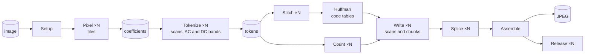

# ctJpeg: jpegli, bit for bit, one image on many cores

**ctJpeg** is a JPEG encoder for Windows x64 that writes *exactly* the same `.jpg` files as **jpegli** (google/jpegli @ 031a007, the `cjpegli` tool), byte for byte, and spreads the encoding of a **single image** over all cores. It is a hand-written C++ port of the jpegli encoder, built on **ThinkMeta.ConcurrentTasks**, a fiber-based task scheduler for Windows.

The parallelization and optimizations were done **AI-assisted**, using ThinkMeta.ConcurrentTasks: AI coding agents wrote, measured and tuned the code under the direction of ThinkMeta's developers, and every step was checked byte for byte against the reference.

jpegli is the JPEG encoder from the JPEG XL team: at the same visual quality its files are smaller than those of mozjpeg and libjpeg-turbo, but it encodes on one core. ctJpeg keeps jpegli's output and makes it fast.

| One image, 7216×5412 (39 MP), `-q 85` | time | vs jpegli |
|---|---:|---:|
| mozjpeg 4.1.5 (`cjpeg`) | 3.13 s | 0.24× |
| jpegli (`cjpegli`, AVX2) | 0.750 s | 1.00× |
| libjpeg-turbo 3.2 (`cjpeg-turbo -optimize -progressive`) | 0.511 s | 1.5× |
| **`ctJpeg`** (16 threads, AVX2) | **0.108 s** | **6.9×** |

*Intel Core i9-11900K (8 cores, 16 threads), Windows 11, High Performance power plan, median of 5, whole process time, every ctJpeg output bit-identical to jpegli on the same SIMD target. Details, all test photos, both feature sets and more CPUs in [Benchmarks](#benchmarks).*

**ctJpeg is 3.4 to 4.7 times as fast as libjpeg-turbo on large images, with jpegli's smaller files** (2 to 18 % smaller than mozjpeg at the same SSIMULACRA2 score in our measurements, mozjpeg in turn being smaller than libjpeg-turbo).

---

## Try it

No installation and no runtime to install: all programs in `bin\` link the C runtime statically and need nothing but Windows (10 or 11, or Windows Server 2016 and later, x64). Any x64 CPU runs ctJpeg (SSE2); the faster `avx2` feature set needs AVX2 and FMA (Intel since Haswell, 2013; AMD since Excavator and Zen).

```cmd
bin\cjpegli --target avx2 input.ppm ref.jpg -q 85
bin\ctJpeg  input.ppm ct.jpg -q 85 --simd avx2
fc /b ref.jpg ct.jpg
```

`fc /b` finds no differences (in PowerShell write `fc.exe`, since `fc` is `Format-Custom` there). Input is binary PPM (8-bit RGB) or PGM (8-bit gray); the full option list is in [Command line](#command-line).

### Feature sets

jpegli does not write the same bytes on every CPU: its SIMD library (Highway) uses fused multiply-add on AVX2 but not on SSE, and sums vector lanes in an order that depends on the vector width. The output falls into two classes, **SSE2/SSSE3/SSE4** and **AVX2**. ctJpeg reproduces both, as feature sets:

* `--simd avx2` writes the bytes of jpegli on AVX2 (`cjpegli --target avx2`), the default on CPUs with AVX2 and FMA;
* `--simd sse2` writes the bytes of jpegli on SSE2, SSSE3 or SSE4 (`cjpegli --target sse2`).

A feature set the CPU does not have is an error, not a silent fallback, because the output would differ. AVX-512 is not supported (Highway disables it when jpegli is built with MSVC).

**On a CPU without AVX2** ctJpeg uses the `sse2` feature set by default and writes the bytes of jpegli on SSE2; `--simd avx2` stops with `ctJpeg: feature set avx2 is not supported by this CPU` and exit code 1 instead of crashing. Only the AVX2 kernels of the pixel phase are compiled for AVX2, and they run only after the feature set is chosen; we checked the binary for AVX2 and FMA instructions outside them (only C runtime functions that choose their code path at run time contain any).

### Benchmark on your own images

```cmd
benchmark\run.cmd "D:\Images"
benchmark\run.cmd "D:\Images" -Quality 90 -Simd sse2 -Sequential
```

The script encodes every PPM/PGM image of the folder with jpegli, ctJpeg, mozjpeg and libjpeg-turbo, measures the wall time and checks for every image that the ctJpeg output is identical to jpegli on the same SIMD target. Other formats can be converted first, e.g. `magick mogrify -format ppm *.png` with ImageMagick. The script switches to the High Performance power plan during the run (or a temporary copy where the plan is hidden) and restores the previous plan afterwards; if Windows refuses the switch, for example on Windows Server without administrator rights, the report says so and the run goes on with the current plan (`-KeepPowerPlan` leaves the plan alone). It runs on Windows PowerShell 5.1 and later. Report and CSV go to `benchmark\results\`. The exit code of `Compare-Folder.ps1` and `run.cmd` is 0 if every image is bit-identical, 2 if one differs or a program failed on it, and 1 for other errors (a program missing in `bin\`, reported before the power plan is touched; wrong parameters; no images). Results of your hardware are welcome.

---

## Benchmarks

<details>
<summary><b>Machine and method</b></summary>

Two measurements, both with whole process time (including reading the PPM file and writing the JPEG), quality 85, the High Performance power plan, and every ctJpeg output compared byte for byte with jpegli on the same SIMD target:

* **Benchmark package on three machines** (the main results below): `benchmark\Compare-Folder.ps1` from the package of `New-BenchPackage.ps1`, 6 photos, AVX2, ctJpeg with all logical processors, encoders interleaved image by image, **median of 5**.
* **Development machine** (i9-11900K, no other load): `Core/Tools/JpegVerify/Benchmark-ctJpeg.ps1`, all 14 photos, **SSE2 and AVX2**, also `ctJpeg --sequential`, best of 3 (scaling: best of 5).

The numbers were measured with a ctJpeg build that used the dynamic C runtime; the published build with the static C runtime writes the same bytes and takes the same time (median of 9 on three photos, both feature sets: 0.976 to 1.003 of the time).

jpegli is `cjpegli --target sse2|avx2` (unmodified jpegli with the SIMD target fixed), ctJpeg `--simd sse2|avx2`, mozjpeg runs with its defaults, libjpeg-turbo with `-optimize -progressive`; mozjpeg and libjpeg-turbo write the same bytes on every SIMD level.

**Test images:** the 8-bit RGB test set of [imagecompression.info](https://imagecompression.info/test_images/): 14 photos of 3.4 to 39 megapixels, 157 megapixels in all, as PPM. The benchmark package uses 6 of them (big_building 39 MP, big_tree 28 MP, spider_web 12 MP, deer 11 MP, cathedral 6 MP, flower_foveon 3.4 MP; 99 MP in all). Free redistribution with the notice of the set; not included in this repository (`benchmark\` works on any folder of PPM/PGM images).

</details>

### Three machines (benchmark package)

The benchmark package (`New-BenchPackage.ps1`) with 6 of the photos (3.4 to 39 MP, 99 MP in all), `-q 85`, AVX2, median of 5, High Performance power plan; 6 of 6 images bit-identical on every machine:

| CPU | jpegli | ctJpeg | vs jpegli | vs libjpeg-turbo | big_building (39 MP) | cathedral (6 MP) | flower_foveon (3.4 MP) |
|---|---:|---:|---:|---:|---:|---:|---:|
| Intel Core i9-11900K, 8 cores / 16 threads | 1.874 s | 0.355 s | **5.3×** | 3.6× | 6.9× | 3.0× | 1.8× |
| Intel Xeon E3-1275 v6, 4 cores / 8 threads | 2.993 s | 0.537 s | **5.6×** | 3.4× | 5.8× | 4.5× | 3.5× |
| Intel Core Ultra 7 155H, 6P + 8E + 2 LP-E cores, 22 threads | 2.006 s | 0.473 s | **4.2×** | 2.7× | 6.1× | 2.2× | 1.4× |

Large images scale on every machine; small images lose with many workers (see [Room for improvement](#room-for-improvement)).

<details>
<summary><b>Per image</b> on the three machines (AVX2, median of 5)</summary>

**Intel Core i9-11900K (8 cores / 16 threads)**

| Image | MP | jpegli | ctJpeg | vs jpegli | mozjpeg | libjpeg-turbo |
|---|---:|---:|---:|---:|---:|---:|
| big_building | 39.0 | 0.750 s | 0.108 s | 6.9× | 3.128 s | 0.511 s |
| big_tree | 27.7 | 0.536 s | 0.081 s | 6.6× | 2.573 s | 0.362 s |
| spider_web | 12.1 | 0.194 s | 0.046 s | 4.2× | 0.568 s | 0.117 s |
| deer | 10.7 | 0.214 s | 0.045 s | 4.7× | 1.194 s | 0.150 s |
| cathedral | 6.0 | 0.118 s | 0.040 s | 3.0× | 0.453 s | 0.087 s |
| flower_foveon | 3.4 | 0.063 s | 0.034 s | 1.8× | 0.180 s | 0.041 s |

**Intel Xeon E3-1275 v6 (4 cores / 8 threads)**

| Image | MP | jpegli | ctJpeg | vs jpegli | mozjpeg | libjpeg-turbo |
|---|---:|---:|---:|---:|---:|---:|
| big_building | 39.0 | 1.201 s | 0.206 s | 5.8× | 4.906 s | 0.747 s |
| big_tree | 27.7 | 0.867 s | 0.140 s | 6.2× | 3.999 s | 0.529 s |
| spider_web | 12.1 | 0.315 s | 0.061 s | 5.2× | 0.901 s | 0.164 s |
| deer | 10.7 | 0.331 s | 0.062 s | 5.3× | 1.844 s | 0.212 s |
| cathedral | 6.0 | 0.184 s | 0.041 s | 4.5× | 0.703 s | 0.119 s |
| flower_foveon | 3.4 | 0.096 s | 0.028 s | 3.5× | 0.272 s | 0.051 s |

**Intel Core Ultra 7 155H (6P + 8E + 2 LP-E cores, 22 threads)**

| Image | MP | jpegli | ctJpeg | vs jpegli | mozjpeg | libjpeg-turbo |
|---|---:|---:|---:|---:|---:|---:|
| big_building | 39.0 | 0.806 s | 0.133 s | 6.1× | 3.235 s | 0.528 s |
| big_tree | 27.7 | 0.583 s | 0.108 s | 5.4× | 2.702 s | 0.372 s |
| spider_web | 12.1 | 0.207 s | 0.065 s | 3.2× | 0.590 s | 0.118 s |
| deer | 10.7 | 0.224 s | 0.066 s | 3.4× | 1.261 s | 0.151 s |
| cathedral | 6.0 | 0.122 s | 0.056 s | 2.2× | 0.462 s | 0.087 s |
| flower_foveon | 3.4 | 0.064 s | 0.046 s | 1.4× | 0.181 s | 0.039 s |

</details>

<!-- BENCHMARK: further CPUs (e.g. AMD Ryzen, more cores) with the same package and settings -->

### All 14 photos (development machine, SSE2 and AVX2)

| Encoder | SSE2 time | vs jpegli | AVX2 time | megapixels/s | vs jpegli |
|---|---:|---:|---:|---:|---:|
| mozjpeg 4.1.5 | 13.63 s | 0.25× | 13.63 s | 11.5 | 0.24× |
| libjpeg-turbo 3.2 (optimize + progressive) | 2.15 s | 1.55× | 2.15 s | 73.1 | 1.49× |
| jpegli (reference) | 3.34 s | 1.00× | 3.21 s | 48.9 | 1.00× |
| `ctJpeg --sequential` (one thread) | 2.51 s | 1.33× | 2.12 s | 74.1 | 1.52× |
| **`ctJpeg`** (16 threads) | **0.69 s** | **4.82×** | **0.65 s** | **243** | **4.96×** |

<details>
<summary><b>Per image</b> on the development machine (SSE2 and AVX2, one thread and 16)</summary>

| Image | MP | jpegli SSE2 | ctJpeg SSE2, 1 thread | ctJpeg SSE2 | vs jpegli | jpegli AVX2 | ctJpeg AVX2, 1 thread | ctJpeg AVX2 | vs jpegli |
|---|---:|---:|---:|---:|---:|---:|---:|---:|---:|
| big_building | 39.0 | 0.828 s | 0.622 s | 0.123 s | 6.7× | 0.810 s | 0.531 s | 0.106 s | 7.6× |
| big_tree | 27.7 | 0.600 s | 0.456 s | 0.104 s | 5.8× | 0.568 s | 0.379 s | 0.081 s | 7.0× |
| spider_web | 12.1 | 0.232 s | 0.165 s | 0.045 s | 5.2× | 0.205 s | 0.135 s | 0.044 s | 4.7× |
| bridge | 11.1 | 0.261 s | 0.189 s | 0.046 s | 5.7× | 0.247 s | 0.160 s | 0.048 s | 5.2× |
| deer | 10.7 | 0.238 s | 0.170 s | 0.046 s | 5.1× | 0.227 s | 0.142 s | 0.043 s | 5.3× |
| fireworks | 7.4 | 0.136 s | 0.105 s | 0.039 s | 3.5× | 0.130 s | 0.088 s | 0.038 s | 3.4× |
| nightshot_iso_100 | 7.4 | 0.139 s | 0.109 s | 0.039 s | 3.6× | 0.130 s | 0.090 s | 0.040 s | 3.2× |
| nightshot_iso_1600 | 7.4 | 0.168 s | 0.132 s | 0.041 s | 4.1× | 0.170 s | 0.102 s | 0.039 s | 4.4× |
| artificial | 6.3 | 0.125 s | 0.094 s | 0.035 s | 3.6× | 0.120 s | 0.084 s | 0.036 s | 3.4× |
| hdr | 6.3 | 0.118 s | 0.098 s | 0.036 s | 3.3× | 0.115 s | 0.083 s | 0.034 s | 3.4× |
| cathedral | 6.0 | 0.130 s | 0.098 s | 0.038 s | 3.4× | 0.133 s | 0.084 s | 0.036 s | 3.7× |
| leaves_iso_1600 | 6.0 | 0.156 s | 0.113 s | 0.037 s | 4.2× | 0.153 s | 0.099 s | 0.037 s | 4.1× |
| leaves_iso_200 | 6.0 | 0.146 s | 0.111 s | 0.037 s | 3.9× | 0.140 s | 0.096 s | 0.036 s | 3.9× |
| flower_foveon | 3.4 | 0.067 s | 0.053 s | 0.030 s | 2.3× | 0.063 s | 0.045 s | 0.029 s | 2.2× |

The factor grows with the image size: large images have enough work for all workers, for small ones the start of the process and the serial parts weigh more.

</details>

### Quality settings

<!-- BENCHMARK: big_building (or all photos) at -q 50 / 75 / 90 / 95 and -d 1.0: jpegli, ctJpeg --sequential, ctJpeg (all threads), SSE2 and AVX2 -->

<details>
<summary><b>Scaling with threads</b>: 0.56 s on one thread, 0.106 s on 16 (AVX2)</summary>

big_building (39 MP), `-q 85`, best of 5; the phase times come from `ctJpeg --times`:

| Threads | SSE2 total | pixels | tokens | writing | AVX2 total | pixels | tokens | writing |
|---|---:|---:|---:|---:|---:|---:|---:|---:|
| 1 | 0.652 s | 0.371 | 0.188 | 0.079 | 0.564 s | 0.285 | 0.186 | 0.079 |
| 4 | 0.204 s | 0.105 | 0.056 | 0.027 | 0.179 s | 0.081 | 0.056 | 0.025 |
| 8 | 0.135 s | 0.065 | 0.036 | 0.015 | 0.120 s | 0.050 | 0.037 | 0.016 |
| 16 | **0.119 s** | 0.050 | 0.035 | 0.013 | **0.106 s** | 0.039 | 0.034 | 0.011 |

</details>

---

## Why this is hard

A JPEG encoder looks easy to parallelize: blocks of 8×8 pixels are coded independently. jpegli's output is not that simple, and ctJpeg may not change a single byte of it:

- the **adaptive quantization** decides how finely each block is quantized from a field computed over its neighbourhood (pre-erosion in groups of four rows at absolute positions, a 3×3 fuzzy erosion), so a tile of the image needs rows and columns of context that other tiles own;
- a **progressive JPEG** stores the coefficients in several scans, and within a scan runs of empty blocks are coded as one end-of-band run that crosses block rows; jpegli caps a run at 32,767 blocks and splits refinement runs after 255 correction bits, so where a run ends depends on everything before it;
- the **Huffman tables** are optimized from the symbol counts of the whole image, so no scan can be written before all of them are tokenized;
- the **bit stream** is one sequence of variable-length codes per scan, with a zero byte stuffed after every 0xFF, so the bytes of a code depend on the bit position at which all earlier codes end;
- **bit identity** reaches into the floating point arithmetic: the order of every addition, fused or separate multiply-add, and the lane order of SIMD sums decide the quantized coefficients (see [Feature sets](#feature-sets)).

jpegli encodes an image in phases: a pixel phase (color transform, adaptive quantization, DCT, quantization), the tokenization of every progressive scan, Huffman code optimization, and writing the scans. In jpegli the tokenization is the biggest part (44 %), followed by the pixel phase (34 %). ctJpeg runs every phase on all cores:

1. **Pixel phase in tiles:** bands of block rows, split into strips of about 1024 pixel columns. Each tile computes the rows and columns of context it needs itself (the adaptive quantization looks a few pixels beyond each block), so the tiles are independent and the working set of a worker stays in its share of the cache.
2. **Tokenization in bands:** the progressive scans are independent of each other, and each large scan is also split into bands of block rows. A short serial stitch joins the bands: it replays jpegli's end-of-band runs across the band borders, including jpegli's limits (runs of at most 32,767 blocks, refinement runs split after 255 correction bits).
3. **Writing in chunks:** every scan starts on a byte boundary, and large scans are written in parallel chunks as plain bit streams that are then joined bit-exactly, with JPEG's byte stuffing at the chunk borders.
4. **Bit identity:** the same floating point operations in the same order as jpegli on each SIMD target, including Highway's fused multiply-add and lane order. Every change is checked against 870 reference files per feature set (qualities and distances, chroma subsampling, odd image sizes from 1×1 up, grayscale, photos) and against itself with 1 to 16 threads and extreme tile and band sizes.

On one thread ctJpeg is already 1.3 to 1.6 times as fast as jpegli (SIMD kernels and a bit mask tokenizer); with 16 threads the 39-megapixel image takes 5.3 times less time than on one.

The encoder is a sequence of stages; a stage marked ×N hands its jobs to one worker per thread, and the next stage starts when all of them are done:



**[How the graph grew, step by step →](docs/task-graph.md)** from jpegli's single thread to this graph, with the reason and the measured gain of each step.

---

## The reference

**jpegli** is google/jpegli at commit `031a007`, the unmodified source in `jpeg\jpegli\` with its bundled third-party libraries (Highway, skcms, Little CMS, libpng, zlib). The reference program is jpegli's own command line tool `cjpegli` (`tools\cjpegli.cc`), also unmodified. `jpeg\jpegli-oracle\` adds one thing around it: `cjpegli --target <name>` fixes the Highway SIMD target (`sse2`, `ssse3`, `sse4`, `avx2`) before cjpegli runs, so the output of each target can be reproduced on any CPU that has it, and a target the CPU lacks is refused instead of replaced by another; `cjpegli --list` shows the targets of the CPU. `jpeg\jpegli-oracle\Build-Jpegli.cmd` builds it with CMake and Visual Studio 2026 (static C runtime; with MSVC, Highway leaves out AVX-512).

ctJpeg ports the default path of cjpegli; options and inputs outside it are refused with an error message.

<details>
<summary><b>What is ported</b></summary>

| Ported | Not ported (error message) |
|---|---|
| Input PPM (P6, 8-bit RGB) and PGM (P5, 8-bit gray) | PNG, APNG, PFM, PAM, 16-bit samples, alpha, ICC profiles |
| `-q 1..100`, `-d 0..25` | `--target_size`, `--xyb`, `--std_quant` and the other cjpegli options |
| no chroma subsampling (jpegli's default) and `--chroma_subsampling 444` or `420` | 440 and 422 |
| adaptive quantization, optimized Huffman tables, progressive level 2 (all jpegli defaults) | `-p 0` and `-p 1`, `--noadaptive_quantization`, `--nooptimize` |

</details>

**mozjpeg 4.1.5** and **libjpeg-turbo 3.2.0** (`jpeg\mozjpeg-4.1.5\`, `jpeg\libjpeg-turbo-3.2.0\`) are unmodified sources with Visual Studio projects that build `cjpeg.exe` and `cjpeg-turbo.exe` with their NASM SIMD code. They are other encoders, in this repository only for the speed comparison.

---

## Command line

ctJpeg takes cjpegli's command line within the ported scope; `ctJpeg --help` lists it.

```
ctJpeg INPUT OUTPUT [options]
```

<details>
<summary><b>Options</b></summary>

Options with a value can be written `--option=value` or `--option value` (short forms `-q value`, `-d value`).

| Option | Meaning |
|---|---|
| `-q n`, `--quality=n` | quality 1 to 100, mapped to a Butteraugli distance exactly as in cjpegli |
| `-d x`, `--distance=x` | Butteraugli distance 0 to 25; default 1.0. `-q` and `-d` exclude each other |
| `--chroma_subsampling=444` or `=420` | chroma subsampling; default: none (jpegli's default) |
| `-p 2`, `--progressive_level=2` | progressive level; 2 is jpegli's default and the only one ported |

Options of ctJpeg only:

| Option | Meaning |
|---|---|
| `--simd sse2` or `avx2` | feature set, each bit-identical to jpegli on that SIMD target; default: `avx2` on CPUs with AVX2 and FMA, else `sse2`. A feature set the CPU lacks is an error |
| `--threads n` | threads of the scheduler, 1 to 1024; default (or 0): all logical processors |
| `--sequential` | the reference path: the whole encoder in one task on one thread |
| `--quiet` | no message on success |
| `-h`, `--help` | the usage text |

For measurements there are options that never change the output: `--times` prints the time of each phase and of the serial parts, `--band-rows n`, `--strip-width n` and `--scan-bands n` set the work split, and `--dump-coefficients file` writes the quantized coefficients instead of a JPEG.

Errors go to the standard error output with exit code 1: an option that is not supported (`option '…' is not supported`), a value out of range, `--quality` together with `--distance`, an input file that is not binary 8-bit PPM or PGM, a feature set the CPU lacks. Success is exit code 0.

</details>

---

## Repository contents

| Folder / file | Contents |
|---|---|
| `bin\` | `ctJpeg.exe` (encoder, same command line as cjpegli), `cjpegli.exe` (the reference: unmodified jpegli and cjpegli with `--target` to choose the SIMD target, built from `jpeg\`), `cjpeg.exe` (mozjpeg 4.1.5) and `cjpeg-turbo.exe` (libjpeg-turbo 3.2.0) for comparison and `ThinkMeta.ConcurrentTasks.Core.dll` (scheduler core), all with the static C runtime |
| `jpeg\jpegli\` | Unmodified jpegli source (google/jpegli @ 031a007) with its bundled third-party libraries |
| `jpeg\jpegli-oracle\` | The small wrapper that builds `cjpegli.exe` with `--target` (CMake), and `Build-Jpegli.cmd` |
| `jpeg\mozjpeg-4.1.5\`, `jpeg\libjpeg-turbo-3.2.0\` | Unmodified sources with Visual Studio projects |
| `jpeg.slnx` | Builds `cjpeg.exe` and `cjpeg-turbo.exe` from these sources (Visual Studio 2026, x64, needs [NASM](https://www.nasm.us); output in `jpeg\build\Release\bin`) |
| `benchmark\` | `Compare-Folder.ps1` and `run.cmd`: speed and bit identity on your own images |
| `New-BenchPackage.ps1` | Packs `bin\` and the benchmark into a zip for other PCs |
| `COPYING`, `LICENSE-Core.txt`, `LICENSE.txt` | the licenses, see [License](#license) |

---

## Room for improvement

ctJpeg is not finished; the measurements point to these next steps:

* **Small images on CPUs with many threads:** ctJpeg starts one worker per logical processor. For an image of a few megapixels that is more workers than there is work, and their fixed costs show: a 3.4-megapixel photo takes 0.028 s on a 4-core Xeon with 8 workers but 0.046 s on a Core Ultra 7 155H with 22, slower than libjpeg-turbo there. The number of workers will follow the image size.
* **Hybrid CPUs:** on the Core Ultra 7 155H (performance and efficiency cores) ctJpeg reaches 4.2× over all test photos against 5.3 to 5.6× on the other machines, although large images scale as well as elsewhere (6.1×).
* **Pixel phase and tokenization in one pass:** today the pixel phase writes all quantized coefficients to memory and the tokenization reads them back; tokenizing each band while it is still in the cache should save another 10 to 15 % on large images.
* **Single-thread tokenizer:** on one thread the tokenization takes about as long as in jpegli; more SIMD there helps at every thread count.

Every step keeps the output bit-identical to jpegli.

---

## ThinkMeta.ConcurrentTasks

### Why fibers here

At its core ctJpeg is fork-join: the encode is a fixed sequence of phases (pixel tiles, token bands, the stitches, write chunks, splicing, freeing), each a list of up to several hundred independent jobs that one task per worker claims from a shared counter, and no job waits for another in the middle of its work. The encoder itself runs as a task and waits for each phase on a task group, so it reads as plain sequential code, and its waiting suspends a fiber instead of blocking a thread. A thread pool with one barrier per phase could do the same work; ctJpeg uses no fiber feature beyond this, and we have not measured it against a thread-pool version.

`ctJpeg` is a showcase for **ThinkMeta.ConcurrentTasks**, a fiber-based task scheduler and concurrency runtime by ThinkMeta Software GmbH. Tasks run on lightweight user-mode fibers: a task waiting for another yields without blocking its worker thread, and a task switch costs a few hundred nanoseconds.

👉 **Get in touch:** [www.thinkmeta.com](https://www.thinkmeta.com)

---

## License

* **jpegli source and `bin\cjpegli.exe`** (`jpeg\jpegli\`, `jpeg\jpegli-oracle\`): BSD 3-Clause License of the JPEG XL Project Authors ([`COPYING`](COPYING)), with the patent grant in [`jpeg\jpegli\PATENTS`](jpeg/jpegli/PATENTS); the bundled libraries in `jpeg\jpegli\third_party\` under their own licenses (Highway, skcms, Little CMS, libpng, zlib).
* **mozjpeg and libjpeg-turbo** (`jpeg\mozjpeg-4.1.5\`, `jpeg\libjpeg-turbo-3.2.0\`, `bin\cjpeg.exe`, `bin\cjpeg-turbo.exe`): the IJG License, the Modified BSD License and the zlib License, see `LICENSE.md` in each folder.
* **ctJpeg binary** (`bin\ctJpeg.exe`): proprietary, Copyright (c) 2026 ThinkMeta Software GmbH, under the same provisional terms as the scheduler core ([`LICENSE-Core.txt`](LICENSE-Core.txt)): free for private and non-commercial use, commercial use requires a license from ThinkMeta Software GmbH. It contains code ported from jpegli, whose BSD notice is in [`COPYING`](COPYING). jpegli's patent grant ([`jpeg\jpegli\PATENTS`](jpeg/jpegli/PATENTS)) covers jpegli itself; whether it extends to this port has not been assessed. The source code is planned to be published under the MIT License.
* **Scheduler core** (`bin\ThinkMeta.ConcurrentTasks.Core.dll`): proprietary, the same terms as `ctJpeg.exe` ([`LICENSE-Core.txt`](LICENSE-Core.txt)).
* **Benchmark scripts** (`benchmark\`, `New-BenchPackage.ps1`): MIT License, Copyright (c) 2026 ThinkMeta Software GmbH ([`LICENSE.txt`](LICENSE.txt)); the MIT License covers only these scripts.

**Benchmarks are explicitly permitted:** anyone may run benchmark tests of any kind with the programs in `bin\`, on any hardware and for any purpose, commercial evaluation included, and publish the results, including comparisons with other software, without asking ThinkMeta Software GmbH first (point 2 of [`LICENSE-Core.txt`](LICENSE-Core.txt)).
