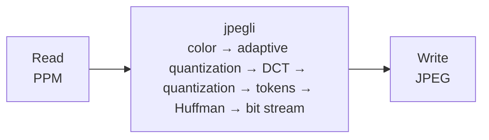
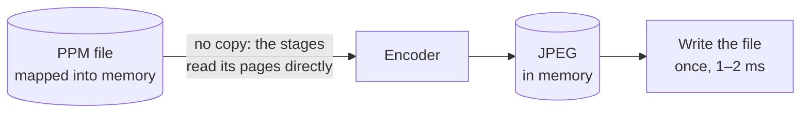
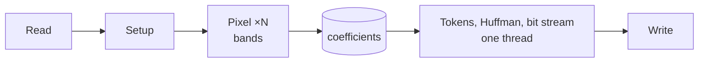
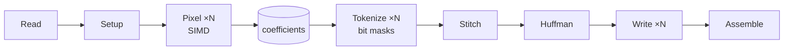
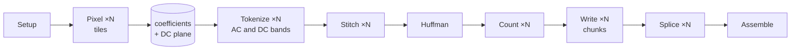
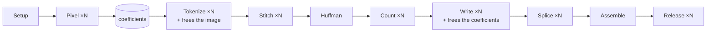
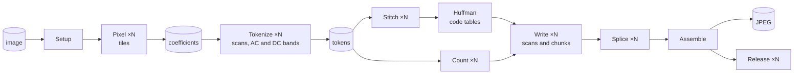

# How ctJpeg's task graph grew

ctJpeg did not start parallel. It started as a faithful port of jpegli's encoder and was taken apart
step by step, each step measured and checked byte for byte against jpegli. This page shows the task
graph after each step: what changed, why, and what it gave.

[← back to the README](../README.md)

ctJpeg is not a stream of frames through a pipeline. It encodes one image as a **sequence of
stages**: each parallel stage hands a few hundred independent jobs to one worker per thread, and the
next stage starts when all of them are done (fork-join). The edges are buffers in memory that one
stage fills and a later one reads.

**Three series of numbers.** All numbers are for one photo, 7216×5412 (39 megapixels), `-q 85`, on an
Intel Core i9-11900K (8 cores, 16 threads), as whole process time including reading and writing the
files. Only numbers within one series compare:

| Series | Steps | How it was measured |
|---|---|---|
| **development** | 0, 2 to 5 | single measurements during development, mostly AVX2 and 16 threads, jpegli measured alongside |
| **I/O test** | 1 | A/B test of three variants of today's encoder, alternating, 11 rounds, AVX2, 16 threads, median of the per-run ratios |
| **tuning** | 6 and 7 | benchmark script on a quiet machine, best of 3 or 5, and series of 9 runs |
| **benchmark package** | 8 | the benchmark package of this repository, median of 5, High Performance power plan; the numbers of the README |

| Shape | Meaning |
|---|---|
| box | a stage that runs once, in the encoder's own task |
| box ×N | a parallel stage: many jobs, one worker task per thread |
| cylinder | an edge: a buffer in memory |
| arrow | data flow; a stage starts when the one before it is done |
| dotted loop | state carried from block to block or band to band |

---

## 0 · The reference: jpegli

One thread does everything in turn. jpegli is the JPEG encoder of the JPEG XL team: smaller files
than mozjpeg and libjpeg-turbo at the same visual quality, but on one core.

**Result (development series):** 0.78 to 0.88 s, depending on the run and the SIMD target.

These bytes are the yardstick: every later step writes exactly the same JPEG file, for each SIMD
feature set (SSE2 and AVX2) separately.

---

## 1 · Input and output: the file mapped into memory, no reader task

**Change:** in our other encoders the first step is asynchronous reading and writing on an I/O
scheduler of their own, so the encoder never waits for data. For ctJpeg we tested the same, and the
measurements said no: the input is not read but mapped into memory. The pixel phase reads the pages
of the file directly, later on all cores at once, without copying a byte. The JPEG is written once
at the end. (The mapping came during development together with the SIMD kernels, step 5; it is
shown first here so that every product starts with input and output.)

**Why (I/O test):**

| Photo | Reading into a buffer first | Writing the file while the workers free memory |
|---|---:|---:|
| 39 megapixels (117 MB) | 1.30 (reading takes 37 ms) | 1.02 |
| 11 megapixels | 1.21 (11 ms) | 0.97 |
| 3.4 megapixels | 1.09 (3 ms) | 0.97 |

- **Reading:** a reader task has to copy the file into a buffer, 37 ms for 117 MB, and the pixel
  phase gains only 4 ms from it. Even fully asynchronous it could at best hide the copy: it reads at
  about 3 GB/s, and the pixel phase consumes the data at about 2.7 GB/s with 16 threads, so the
  reader would barely stay ahead of the stage waiting for it, and it would take a hardware thread
  away from that stage. Mapping does the same job without a copy, spread over all pixel workers.
- **Writing:** the file can only be written after the last stage, because the Huffman tables come
  before the scans and need the counts of all of them. Then writing takes 1 to 2 ms; overlapping it
  with freeing the memory gave 0.97 to 1.02 of the time, measurement noise.

**Result (I/O test):** no I/O scheduler for ctJpeg. Asynchronous reading would make the large photo
30 % slower, asynchronous writing gives nothing measurable. All variants wrote the same bytes.

---

## 2 · The port: the same graph, our own code

<picture>
  <source media="(prefers-color-scheme: dark)" srcset="images/step-2-state-dark.svg">
  
</picture>

Rendered with Mermaid's ELK layout, which draws the loops more cleanly than GitHub's built-in renderer; source: [images/step-2-state.mmd](images/step-2-state.mmd).

**Change:** jpegli's encoder, ported by hand to C++ and split into phases: setup, the pixel phase
(color, adaptive quantization, DCT, quantization) and the entropy coding (tokens, Huffman tables, bit
stream). Between them lies the buffer of quantized coefficients.

**Why:** first a readable port that writes the same bytes, then parallelism. The loops show what
stands in the way: the tokens of a progressive scan carry runs of empty blocks from block to block,
and the bit stream carries its bit position. The pixel phase has no loop: it only looks a few pixels
around each block, so it already works in bands that compute their own border rows.

**Result (development series):** 1.25 s (SSE2) and 1.27 s (AVX2) against jpegli's 0.80 and 0.75 s,
about 1.6 times slower, but bit-identical in every test case. This graph is still in ctJpeg today:
`--sequential`.

---

## 3 · The pixel phase goes parallel

**Change:** the bands of the pixel phase become jobs, about four per worker. Each worker takes the
next band from a shared counter; the encoder waits until all bands are done.

**Why:** the adaptive quantization only needs a small window around each block, so with a few rows of
context computed twice, every band is independent of the others.

**Result (development series, AVX2):** the pixel phase drops from 0.76 s on one thread to 0.12 s on
16, a factor of 6.4. The whole encode takes 0.70 s, 1.17 times as fast as jpegli. The serial entropy
coding (0.48 s) is now the limit.

---

## 4 · Tokens and the bit stream go parallel

<picture>
  <source media="(prefers-color-scheme: dark)" srcset="images/step-4-stitch-dark.svg">
  
</picture>

Rendered with Mermaid's ELK layout; source: [images/step-4-stitch.mmd](images/step-4-stitch.mmd).

**Change:** the entropy coding is taken apart on two levels.
- **Scans:** the scans of a progressive JPEG are independent of each other, one job each.
- **Bands:** the large scans are also cut into bands of block rows. Each band starts with a fresh
  state and reports compactly how it begins. A short **stitch** per scan then replays these
  beginnings with the real state: the runs of empty blocks across band borders, including jpegli's
  limits (a run ends after 32,767 blocks, a refinement run after 255 correction bits). The loop
  moved from every block to one step per band.
- **Writing:** in jpegli every scan ends on a byte boundary, so each scan is written into a buffer of
  its own, and a short serial step assembles them with their headers.

Only the Huffman tables stay serial: they need the symbol counts of all scans.

**Why:** after step 3 the entropy coding was the serial rest, the larger part of the work.

**Result (development series, AVX2):** 1.31 s on one thread, **0.31 s on 16**, 2.6 times as fast as
jpegli.

---

## 5 · The same graph, less work per stage

**Change:** the graph stays; every stage gets faster. SIMD kernels for the pixel phase with exactly
jpegli's arithmetic (SSE2 with 4 lanes; AVX2 with 8 lanes and fused multiply-add), a tokenizer that
finds the non-zero coefficients of a block by bit masks, and buffers reused per worker.

**Why:** after step 4 ctJpeg was still slower than jpegli on one thread.

**Result (development series):** one thread 0.55 to 0.64 s, already 1.4 to 1.5 times as fast as
jpegli; 16 threads **0.24 s**. But the pixel phase now scaled only about 3 times.

---

## 6 · Smaller jobs that fit the cache

**Change:** a trace of every job showed, for every stage, which job finished it last. In a fork-join,
that job sets the time of the stage:

| Found | Changed | Gain |
|---|---|---|
| the DC scan ran as one job, and it ran last | DC scan in bands too, at least one per worker | tokens 69 → 56 ms |
| each large refinement scan was written by one worker | writing in chunks: **Count** finds where each chunk starts reading, **Write** writes plain bit streams, **Splice** joins them byte-exactly with JPEG's byte stuffing | writing 28 → 10–13 ms |
| a pixel job took 22 ms in parallel but 8 ms alone: the working sets of 16 workers overflowed the cache | pixel phase in tiles of about 1024 pixels width | pixel phase 89 → 38–46 ms |
| the DC bands touched every cache line of the coefficients | a dense plane of DC values, filled by the pixel phase | DC bands about 2 ms |
| the last AC bands decided when tokenizing ended | finer bands | tokens 39 → 33 ms |

**Why:** the work was spread well, but single jobs were too big or ran into memory.

**Result (tuning series):** **0.14 s** at 16 threads. The time now falls all the way to 16 threads;
before, the best was at 6 to 8.

An instructive detour: before the tiles, bands of a single block row were faster with 8 threads than
the default bands. It looked like load balancing; it was the cache. Only the same image at a quarter
of the width, where the pixel phase scaled 5.8 instead of 3.5 times, made it visible.

---

## 7 · The serial rest goes parallel

**Change:** a new parallel stage, **Release**, and two extra jobs: the input image is freed while
the tokens are made, the coefficients while the scans are written.

**Why:** at 16 threads about 0.05 s lay outside the stages, most of it in giving hundreds of
megabytes back to Windows at the end. Leaving the memory to the end of the process does not help (we
measured: same total time, the cost only moves); spread over the workers, it shrinks.

**Result (tuning series, AVX2):** freeing 26 → 7–8 ms; whole encode 0.143 → **0.109 s**.

An instructive miss: freeing the coefficient buffer in parallel pieces was slower (11 → 14 ms); the
pieces of one memory region get in each other's way.

---

## 8 · The complete graph

**Change:** the graph now stands in one place in the code, its nodes and edges in data flow order,
and `--sequential` is a graph of its own with a single task. The computing kernels did not change:
an A/B test against the previous build gave 0.96 to 1.04 of the time on three photos, with all
threads, few threads and one, both feature sets — measurement noise.

**Result (benchmark package, AVX2, all outputs bit-identical to jpegli):**

| Machine | jpegli | ctJpeg | vs jpegli |
|---|---:|---:|---:|
| Intel Core i9-11900K (8 cores / 16 threads), the 39-megapixel photo | 0.750 s | 0.108 s | **6.9×** |
| Intel Core i9-11900K, 6 photos (99 megapixels) | 1.874 s | 0.355 s | 5.3× |
| Intel Xeon E3-1275 v6 (4 cores / 8 threads), 6 photos | 2.993 s | 0.537 s | 5.6× |
| Intel Core Ultra 7 155H (22 threads, hybrid), 6 photos | 2.006 s | 0.473 s | 4.2× |

[← back to the README](../README.md)
