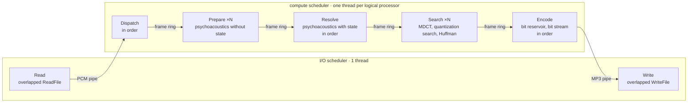

# ctLame: LAME, bit for bit, fourteen times faster

**ctLame** is an MP3 encoder that produces *exactly* the same files as LAME 4.0 (byte for byte)
and runs **14 times as fast** on an 8-core desktop CPU. It is a C++ port of LAME's VBR encoder,
built on **ThinkMeta.ConcurrentTasks**, a fiber-based task scheduler for Windows, and a first
look at the research project around it that runs from 2027 to 2029
([what comes next](#what-comes-next)).

The parallelization and optimizations were done **AI-assisted**, using ThinkMeta.ConcurrentTasks: AI
coding agents wrote, measured and tuned the code under the direction of ThinkMeta's developers, and
every step was checked byte for byte against the reference.

**ctLame.exe is not included yet.** It will be added once the LAME project has agreed to publishing
the binary ahead of its LGPL source code; the source code of ctLame will follow under the GNU LGPL.
The benchmark results below were measured with it.

| | lame.exe | ctLame |
|---|---:|---:|
| 45 hours of CD audio (343 files), `-V 4` | 19 min 29 s | **83 s** |
| speed | 139× real time | **1956× real time** |
| output | reference | **bit-identical** |

This repository contains:

| Folder | Contents |
|---|---|
| `bin\` | prebuilt Windows x64 binaries: `lame.exe` (the reduced LAME below) and `ThinkMeta.ConcurrentTasks.Core.dll`, the scheduler core ctLame.exe runs on; it is included already and is used once `ctLame.exe` is added |
| `lame\` | the source of the **reduced LAME 4.0**, the reference ctLame is measured against |
| `lame.slnx` | a Visual Studio solution that builds `lame.exe` from that source |
| `benchmark\` | a script to compare both encoders on your own WAV files: speed and bit identity (needs `ctLame.exe` in `bin\`) |

## Try it

No installation and no runtime to install: the C runtime is linked statically; `bin\lame.exe`
needs nothing but Windows (10 or 11, x64).

```
bin\lame -V 2 input.wav lame.mp3
```

Once `ctLame.exe` is added, it takes the same command line and writes the same bytes:
`bin\ctLame -V 2 input.wav ctlame.mp3`, then `fc /b lame.mp3 ctlame.mp3` reports no differences.
ctLame accepts every option of the reduced LAME and prints the same messages.

With `ctLame.exe` in `bin\`, `benchmark\run.cmd D:\Music` (any folder of WAV files) encodes every
file with both programs, one process at a time, and writes a report with the times and the
bit-identity check of each file. Every run reads a fresh copy of the file that is not in the file
cache (`-Warm` reads the files where they are). For the run it switches to the High Performance
power plan and restores the previous one afterwards (`-KeepPowerPlan` leaves it alone).

## Benchmarks

<details>
<summary><b>Machine and method</b></summary>

| | |
|---|---|
| CPU | Intel Core i9-11900K (Rocket Lake), 8 cores, 16 threads |
| System | Windows 11 Pro, power plan High Performance, no other load |
| Programs | `bin\lame.exe` and ctLame.exe 0.1, the build that will be added to `bin\` |
| Settings | `-V 4` (LAME's default VBR quality), all other options at their defaults |
| Timing | wall time of the whole process (start, reading the WAV file, encoding, writing the MP3), one process at a time; per file the programs take turns, three rounds, the median of each file counts, the totals are the sums of the medians |
| Check | every MP3 of ctLame compared byte for byte with lame.exe's |
| Run | 8 October 2026 with `benchmark\run.cmd <folder> -Rounds 3`, the script in `benchmark\` |

</details>

### Corpus

343 WAV files ripped from CDs (44.1 kHz, 16 bit, stereo), 45 h 5 min of music in all: 313 single
tracks of 39 seconds to 9 minutes (21.7 hours) and 30 complete albums or discs saved as one file
each, 17 to 79 minutes long (23.4 hours): blues rock and classical crossover.

### Results

| Program | Time | Real-time factor | vs. lame.exe |
|---|---:|---:|---:|
| `lame.exe` (reference) | 1168.8 s | 139× | 1.00 |
| `ctLame` (all 16 threads) | 83.0 s | 1956× | **14.08** |

All 343 MP3 files of ctLame were bit-identical to lame.exe's.

On a single thread (`ctLame --sequential`, measured on 21 of the files, 3 h 9 min of music, one
round) ctLame took 50.5 s against 87.8 s for lame.exe, **1.74 times as fast**, thanks to
restructured loops and SIMD paths (SSE4.1, AVX2) that compute the same operations in the same
order as the scalar code, so they too give identical bits.

<details>
<summary><b>Per file</b>: short files gain less</summary>

| Files | Audio | lame.exe | ctLame | vs. lame.exe | per file: median (min to max) |
|---|---:|---:|---:|---:|---:|
| 313 single tracks | 21.7 h | 563.9 s | 41.7 s | 13.51 | 13.77 (7.19 to 14.77) |
| 30 albums in one file | 23.4 h | 604.9 s | 41.3 s | 14.66 | 14.70 (13.66 to 15.19) |

The shorter the file, the more the start of the process and the filling and draining of the
pipeline weigh: the lowest factor, 7.2, belongs to a 39-second intro, while every file of more than
16 minutes is encoded at least 13.7 times as fast.

</details>

### Other CPUs

The same 343 files, the same binaries and method (`benchmark\run.cmd <folder> -Rounds 3`):

| CPU | Cores / threads | lame.exe | ctLame | Real-time factor | vs. lame.exe |
|---|---|---:|---:|---:|---:|
| Intel Core i9-11900K (Rocket Lake, desktop) | 8 / 16 | 1168.8 s | 83.0 s | 1956× | **14.08** |
| Intel Xeon E3-1275 v6 (Kaby Lake, server, Windows Server 2016) | 4 / 8 | 1726.1 s | 212.1 s | 765× | **8.14** |
| Intel Core Ultra 7 155H (Meteor Lake, notebook) | 6 P + 8 E + 2 LP-E / 22 | 1313.1 s | 174.1 s | 933× | **7.54** |

<details>
<summary><b>Split by file length</b>: the notebook slows down under sustained load</summary>

| CPU | single tracks | albums in one file |
|---|---:|---:|
| Core i9-11900K | 13.51 | 14.66 |
| Xeon E3-1275 v6 | 8.06 | 8.22 |
| Core Ultra 7 155H | 10.90 | 5.79 |

On the notebook ctLame keeps up on the single tracks but loses half its speed on the albums,
which ran last; lame.exe, on one core, does not slow down there (see
[room for improvement](#room-for-improvement)).

</details>

Every encoding was bit-identical to LAME on every machine.

## Why this is hard

Parallelizing an MP3 encoder is easy if you may change its output: cut the audio into pieces and
encode them independently. ctLame may not. Its output has to be exactly LAME's, and LAME is
sequential by design:

- the **psychoacoustic model** carries state from frame to frame: attack detection, the switch
  between long and short blocks, pre-echo control, the adaptive hearing threshold;
- the **bit reservoir** lets a frame borrow bits that earlier frames left unused, so how a frame is
  coded depends on every frame before it;
- the **MDCT filterbank** needs the samples of the previous granule.

ctLame splits the work of each frame (1152 samples) into the parts that need this state and the
parts that do not. The stateless parts (FFTs, spreading, MDCT, the search for scalefactors and
quantization, Huffman coding) run for many frames at once on all cores; the stateful parts run as
thin links in frame order:



**[How the graph grew, step by step →](docs/task-graph.md)** from LAME's single loop to this graph,
with the reason and the measured gain of each step.

The frames in flight live in a ring of four slots per compute thread (16 to 128), the size that
measured best: fewer slots leave threads waiting for the ordered stages, more cost cache. Every
stage is a task on
ThinkMeta.ConcurrentTasks: when a stage waits for the frame before it, its task is suspended, and
the thread runs other work meanwhile. Handing a frame from one thread to another costs about
0.4 µs, against about 200 µs of work per frame.

Every change was checked against LAME's output: SHA-256 of 1372 encodings of 343 files and of
about 1000 encodings with other settings and input formats (mono, 32/48 kHz, 8/24/32 bit, float),
plus a comparison of 1012 command lines with all their console output.

## The reduced LAME

`lame\` is LAME 4.0 (release `RELEASE__4_0`, SVN r6552) reduced to what ctLame implements:
**MPEG-1 Layer III with the "new" VBR routine** (`-V`, `vbr_mtrh`) from **WAV files**.

| Kept | Removed |
|---|---|
| VBR new: `-V 0..9.999`, `-q`, the VBR presets | CBR, ABR, VBR old, free format |
| MPEG-1: 32, 44.1 and 48 kHz | MPEG-2/2.5, resampling |
| WAV input: PCM 8/16/24/32 bit, 32-bit float, also WAVE_FORMAT_EXTENSIBLE | AIFF, raw PCM, MP3 input, stdin and stdout |
| Xing/LAME VBR header | ID3v1/ID3v2 tags, ReplayGain, the frame analyzer |
| all options that tune VBR new: channel mode, bitrate limits, filters, ATH, noise shaping, short blocks, bit reservoir, scaling | the decoder, `--nogap`, the CPU/assembly dispatch (the SSE2 intrinsics path is always on) |

<details>
<summary><b>Size, output and build</b></summary>

The tree shrank from 319 to 68 files; libmp3lame from 26 301 to 16 782 lines, the frontend from
11 188 to 4 223 lines, `lame.h` from 1 357 to 800 lines, with no compiler warning left (57 before,
x64, warning level 4). The core of VBR new (`psymodel.c`, `vbrquantize.c`, `newmdct.c`, `fft.c`,
`tables.c`, `reservoir.c`) is nearly untouched.

**Output:** for the same options and a supported input file, the reduced `lame.exe` writes the same
bytes as unmodified LAME 4.0 run with `--noreplaygain`. The one exception: unmodified LAME lowers
the sample rate at `-V 6.5` and above (44.1/48 kHz) and at `-V 8` and above (32 kHz); the reduced
LAME always keeps the input rate, and is then identical to unmodified LAME with
`--resample <input rate>`. The default is `-V 4` instead of CBR 128 kbit/s.

Build it with Visual Studio 2022 or newer (C++ desktop workload):

```
msbuild lame.slnx /p:Configuration=Release /p:Platform=x64
```

The result is `build\Release\lame.exe`, built with the settings of `bin\lame.exe`. Each published
program has its fastest build: `ctLame.exe` is in addition profile-guided optimized (PGO) and
built without buffer security checks, which makes it about 4 % faster; for `lame.exe` both made it
slower (by 2.6 %), so it keeps the plain build.

</details>

## Command line

ctLame takes LAME's command line; `ctLame --help` and `ctLame --longhelp` list everything.

```
ctLame [options] <infile.wav> [outfile.mp3]
```

Options of ctLame only:

| Option | Meaning |
|---|---|
| `--threads n` | compute threads, 1 to 256; default: all logical processors |
| `--sequential` | the whole encoder as one task on one thread (the reference path) |
| `--simd level` | the highest SIMD level to use: `scalar`, `sse4.1` or `avx2`; default: the highest the CPU supports. All levels give the same bits |
| `--features` | print the CPU features and the SIMD level in use |

<details>
<summary><b>LAME's options</b>, all of which ctLame accepts</summary>

| Option | Meaning |
|---|---|
| `-V n` | VBR quality, 0 (best, largest) to 9.999 (smallest); default 4 |
| `-q n` | algorithm quality, 0 (best, slowest) to 9; default 3. `-h` = `-q 2`, `-f` = `-q 7` |
| `--preset type` | `medium`, `standard` or `extreme`: the same as `-V 4`, `-V 2`, `-V 0` |
| `-b n`, `-B n`, `-F` | minimum and maximum bitrate in kbit/s, enforce the minimum strictly |
| `-m mode` | `j` joint stereo (default), `s` simple stereo, `f` forced mid/side, `d` dual mono, `m` mono, `l` left, `r` right |
| `-a` | downmix stereo to mono |
| `--lowpass f`, `--highpass f`, `--lowpass-width f`, `--highpass-width f` | filters, in kHz |
| `--scale x`, `--scale-l x`, `--scale-r x`, `--gain dB`, `--swap-channel` | input scaling |
| `--ignorelength` | ignore the data length in the WAV header |
| `-Y`, `-Z [n]`, `--athaa-sensitivity x`, `--r3mix` | psychoacoustic tuning |
| `-t`, `-T` | do not write / force the LAME tag |
| `-p`, `-c`, `-o`, `-e emp` | CRC, copyright and original flags; emphasis `n`, `5` or `c` |
| `--nores`, `--strictly-enforce-ISO`, `--buffer-constraint c` | bit reservoir and stream constraints; `c` is `default`, `strict` or `maximum` |
| `--quiet`, `--silent`, `--brief`, `--verbose`, `-S` | console output |
| `--priority n` | process priority, 0 (idle) to 4 (high) |
| `--license`, `--version` | license and version |

</details>

## Room for improvement

ctLame is fast, but not at the end; the measurements point to these limits and next steps:

* **Notebooks under sustained load:** on the Core Ultra 7 155H ctLame reaches 10.9× on the single
  tracks, but only 5.8× on the album-length files, which ran last, after about 35 minutes of full
  load. lame.exe on one core stays as fast on them (127× against 120× real time), so this is
  probably the notebook's sustained power or thermal limit, which cuts the clock of all cores when
  all of them are busy. A desktop CPU (14.7× on the albums) and the server CPU (8.2×) show no such
  drop. Whether fewer threads give more there is still to be measured.
* **Hybrid CPUs:** apart from that, performance and efficiency cores share the work well: on the
  155H all 22 threads are within 2 % of the best thread count. AVX2 brings nothing over SSE4.1
  there, probably because the efficiency cores execute 256-bit instructions in two halves. A
  scheduler that knows the core types is part of the research project.
* **The serial links:** at 16 threads ctLame finishes a frame every 13 µs. The in-order part of the
  psychoacoustics (resolve: attack detection, block switching, pre-echo control) needed about as
  much per frame before its pre-echo control was vectorized, so on this CPU it runs close to its
  limit. Resolve is already split into two short serial parts (about 5 µs per frame together)
  with a parallel part between them, bit-identical; on 8 cores that gave nothing, so it waits for
  CPUs with more cores. The bit stream at the end takes about 4 µs per frame, since the Huffman
  coding moved into the parallel search.
* **Turbo clock and hyperthreading:** the same work costs more time the more threads run: about
  16 % more with 4 threads, 25 % with 8 (lower turbo clock, shared cache) and 50 % with 16, when
  two threads share a core. That is why 16 threads on 8 cores are 8 times as fast as one thread,
  not 16 times. With four cores (Xeon E3) ctLame reaches 8.1×, evenly for short and long files;
  there speed comes only from less work per frame.
* **Short files:** a 39-second file is encoded only 7 times as fast; starting the process and
  filling and draining the pipeline take a larger share there.
* **Less work per frame:** most of the time goes into the search for scalefactors and
  quantization, the psychoacoustic preparation and the MDCT. Long sums stay scalar because their
  order is fixed by bit identity. Tried and dropped: AVX2 gather (half as fast as scalar loads on
  Rocket Lake), AVX-512 lookup tables (would cover only 3 to 7 % more blocks) and a mode without
  bit identity (fused multiply-add): 2 % faster on one thread, nothing on 16.

Every step keeps the output bit-identical to LAME.

## ThinkMeta.ConcurrentTasks

ctLame is a showcase for **ThinkMeta.ConcurrentTasks**, a task scheduler for Windows by
ThinkMeta Software GmbH. Tasks run on fibers: a task can wait for a frame, an event or an
asynchronous file read without blocking its thread. A handful of threads keeps every core busy
while thousands of tasks wait, and code that waits stays as simple as sequential code.

- **Small and fast core:** the scheduler is a 14 KB DLL that depends on nothing but Windows
  (no C runtime). A task switch is a fiber switch; handing work to another thread costs well under
  a microsecond.
- **Building blocks on top:** tasks with priorities, events, semaphores and other synchronization
  primitives for tasks, concurrent collections, pipes in virtual memory, asynchronous file and
  socket I/O over completion ports.
- **Deterministic where it matters:** ctLame shows that a pipeline with ordered and parallel
  stages can keep a strictly sequential result while using every core.

### Why fibers here

ctLame's ordered stages wait in the middle of their work: the dispatcher for a free slot in the ring
of frames, resolve for the psychoacoustic state of the frame before, the bit reservoir for the bits
that frame left over. On ConcurrentTasks such a wait suspends only the task, its thread meanwhile
runs the parallel search of other frames, and each stage stays a plain loop over the frames in
order. With a thread pool every one of these waits would either block a worker or have to be cut
into callbacks that save their state and are queued again once the frame before is done, with a
new frame about every 13 µs at 16 threads.

### What comes next

ctLame is a first look at ThinkMeta.ConcurrentTasks.
From January 2027 to December 2029 the framework is being developed further in a research and
development project, for which ThinkMeta has applied for Germany's research allowance
(Forschungszulage, BSFZ). Today it runs on Windows on x64; the project takes it further:

| Where | What |
|---|---|
| **Operating systems** | Linux and macOS besides Windows |
| **Desktop and server CPUs** | hybrid x64 processors with performance and efficiency cores (Intel Alder, Raptor and Arrow Lake, AMD Zen 4 and 5) |
| **Game consoles** | Xbox (GDK), PlayStation 5 and Nintendo Switch, on top of their own fiber APIs |
| **Embedded CPUs and MCUs** | ARM Cortex-A, -M and -R, RISC-V, Xtensa (ESP32) and PowerPC (automotive), on bare metal and next to RTOSes such as FreeRTOS and Zephyr |

The same task model on every platform: code that waits stays as simple as sequential code, and
fine-grained work (steps of a few microseconds, as in ctLame) is spread over every core.
More reference applications follow ctLame: a FLAC encoder, a deflate archiver and an HTTP server.

Building a game engine, an industrial controller or another product that needs every core?
Want to run your own benchmarks or work with us? [www.thinkmeta.com](https://www.thinkmeta.com)

## License

- `lame\` and `bin\lame.exe`: LAME, GNU Library General Public License version 2 or later
  ([`COPYING`](COPYING)). Copyright (c) 1999-2011 The LAME Project and the authors named in the
  sources.
- ctLame: a port of LAME, therefore also under the GNU LGPL version 2 or later. Copyright (c) 2026
  ThinkMeta Software GmbH for the port, LAME's copyrights for the original. ctLame.exe is not
  included yet. It will be added once the LAME project has agreed to publishing the binary ahead
  of its LGPL source code; the source code of ctLame will follow under the GNU LGPL.
- `bin\ThinkMeta.ConcurrentTasks.Core.dll`: proprietary, Copyright (c) 2026 ThinkMeta Software GmbH;
  terms of use in [`LICENSE-Core.txt`](LICENSE-Core.txt). ctLame.exe loads it at run time. The
  terms cover the DLL only: they permit its private and non-commercial use, commercial use of the
  DLL requires a license from ThinkMeta Software GmbH; they do not limit the rights the LGPL grants
  for ctLame.exe.
- `benchmark\`: MIT license, Copyright (c) 2026 ThinkMeta Software GmbH.

**Benchmarks are explicitly permitted:** anyone may run benchmark tests of any kind with the
programs in `bin\`, on any hardware and for any purpose, commercial evaluation included, and publish
the results, including comparisons with other software, without asking ThinkMeta Software GmbH
first (point 2 of [`LICENSE-Core.txt`](LICENSE-Core.txt)).
