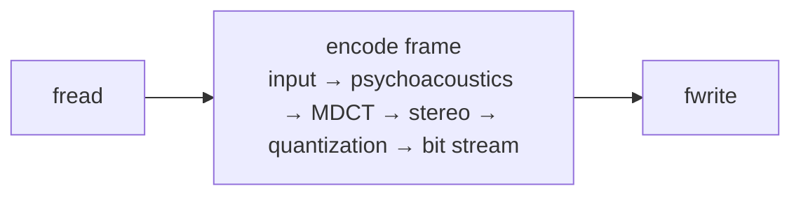
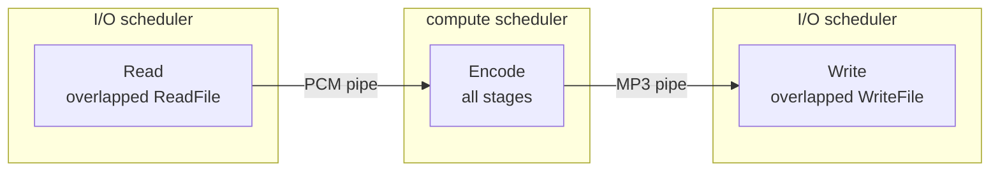
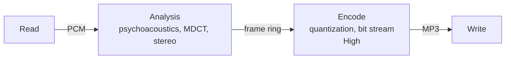
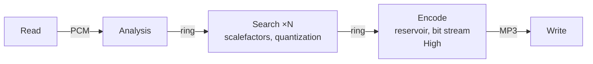
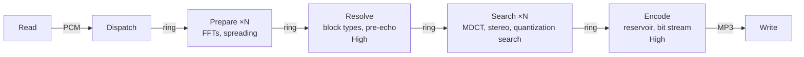
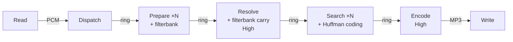
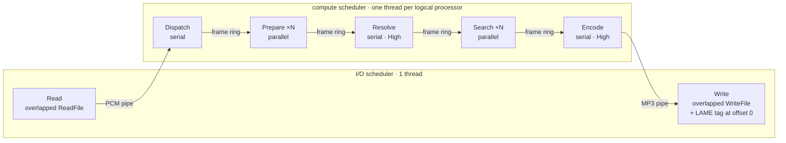

# How ctLame's task graph grew

ctLame did not start parallel. It started as a faithful copy of LAME's loop and was taken apart step
by step, each step measured and checked byte for byte against LAME. This page shows the task graph
after each step: what changed, why, and what it gave.

[← back to the README](../README.md)

**Two series of numbers.** Steps 2 to 5 were measured during development on one test file
(254 seconds of music, 9744 frames, `-V 4`, Intel Core i9-11900K with 16 threads), as the time of the
encoding pipeline. From step 5 on, the factor against `lame.exe` comes from benchmarks over a whole
corpus, as the time of the whole process. Only numbers within one series compare.

| Shape | Meaning |
|---|---|
| box | a task |
| box ×N | one task per compute thread, all doing the same kind of work |
| arrow | an edge: a pipe of bytes or the ring of frames |
| dotted loop | a stage that carries state from frame to frame |
| **High** | a serial task that takes the frames in order, with high priority |

---

## 0 · The reference: LAME

One thread does everything in turn: read, encode, write. Every stage carries state from frame to
frame (the psychoacoustic model, the filterbank, the bit reservoir), so a frame cannot start before
the one before it is done. One core works, the others wait.

These bytes are the yardstick: every later step writes exactly the same MP3 file.

---

## 1 · One encoder task between asynchronous reading and writing

**Change:** reading and writing become tasks with overlapped I/O on an I/O scheduler of their own;
the whole encoder is one task on the compute scheduler.

**Why:** reading and writing now happen *while* the encoder works, not between its frames. The pipes
are bounded; their fill levels raise and lower the priority of the I/O tasks, so the encoder never
waits for data and memory stays small. The LAME tag at the start of the file is only known after the
last frame, so Write puts it there at the end. The I/O chain manages about 600 MB/s, far more than
the encoder will ever need.

**Result:** about as fast as LAME, bit-identical. This graph is still in ctLame today: `--sequential`.

---

## 2 · Untangling the state (the graph stays the same)

<picture>
  <source media="(prefers-color-scheme: dark)" srcset="images/step-2-state-dark.svg">
  
</picture>

Rendered with Mermaid's ELK layout, which draws the loops more cleanly than GitHub's built-in renderer; source: [images/step-2-state.mmd](images/step-2-state.mmd).

**Change:** everything that belongs to one frame moves into one frame record; everything carried from
frame to frame moves into the state of its stage (the loops).

**Why:** you can only run in parallel what you can take apart. Now it is visible which stage carries
which state. Only one dependency crosses both stages and frames: the bit reservoir, which the bit
stream of frame N leaves to the quantization of frame N+1.

**Result:** the same speed (about 2 s for the test file), bit-identical, and a map of where the time goes:
mostly the quantization and the psychoacoustic model.

---

## 3 · Two tasks and a ring of frames

**Change:** the encoder is cut in two between analysis and quantization; a ring of frames connects
the halves. The input becomes one stream of samples per channel in virtual memory, and each frame
points into it instead of copying.

**Why:** both halves take about the same time. As a pipeline they overlap: frame N is quantized while
frame N+1 is analyzed. The later stage runs with high priority, so the pipeline drains before the
analysis runs further ahead. Handing a frame to another thread costs about 0.4 µs against about
200 µs of work per frame, so every frame is handed over on its own.

**Result:** 2122 → 1266 ms (1.68×). Now Encode is the bottleneck.

---

## 4 · The quantization search runs frame-parallel

**Change:** the quantization is split. The search for scalefactors and the quantization run for many
frames at once; only a small commit with the bit reservoir stays serial.

**Why:** about 95 % of the quantization does not depend on the reservoir at all, only on whether a
granule is silent. What really depends on the frame before (the bit budget, the check "does the frame
fit?", the choice of the bitrate) takes a few microseconds.

**Result:** 1266 → 1150 ms. The step also showed that the scheduler woke all sleeping threads for
every new task; waking just one gave 1050 ms. Now the analysis, serial with its state, is the
bottleneck.

---

## 5 · The psychoacoustic model is split: the graph takes its shape

**Change:** the psychoacoustic model is split into a stateless part, *Prepare*, and a serial part,
*Resolve*; the MDCT becomes stateless. Prepare and Search are the same worker tasks, one per thread.

**Why:** about 90 % of the psychoacoustic model needs no state (the long FFTs, the spreading, the
energies for attack detection). Only the decisions run in order: attacks, block types, pre-echo
control against the frames before. The MDCT only seemed to carry state; it is a function of the
input, which the sample stream keeps. The workers take searches first: they belong to older frames
and free slots sooner. Serial are now only three short links: Dispatch, Resolve and Encode.

**Result:** 1050 → **290 ms**, about 8 times as fast as `lame.exe` on the test file.

---

## 6 · The serial links get thin

**Change:** work moves between the nodes. The Huffman coding of each frame moves into the parallel
search, so the serial bit stream only joins the coded pieces. The filterbank runs once in Prepare, and
Resolve hands its state on in order.

**Why:** every microsecond a serial link needs per frame limits all cores together.

**Result:** the serial bit stream from 17 to 3.8 µs per frame; corpus 7.8× → 8.3× `lame.exe`.

Tried and dropped: splitting Resolve further gave nothing on 8 cores, because the workers are fully
busy (it waits for CPUs with more cores); other priorities, look-ahead or a bigger ring stayed
within the noise.

---

## 7 · The same graph, less work per node

**Change:** SIMD paths in the parallel nodes that compute the same operations in the same order as
the scalar code, so they give the same bits; the ring grows with the number of threads.

**Why:** the graph was close to the best this machine allows, so the remaining gains had to come from
less work per frame; with a fixed ring of 32 slots, 16 threads ran out of frames in flight.

**Result:** corpus 8.3× → 12.8× (SIMD) → 14.2× (ring). Even on one thread ctLame is now 1.7 times as
fast as LAME.

---

## 8 · The complete graph

With 16 threads: 21 tasks (Read, Dispatch, 16 workers, Resolve, Encode, Write), and a frame
finished about every 13 µs. The serial tasks wait in the middle of their work (Dispatch for a free
slot, Resolve for the frame before, Encode for the bits it left over); on ConcurrentTasks such a wait
suspends only the task, and its thread meanwhile runs the search of other frames.

**Result**, 343 files, 45 hours of music, whole process: **14.08×** `lame.exe` on the Core i9-11900K,
8.14× on a 4-core Xeon E3, 7.54× on a Core Ultra 7 155H notebook. Every file bit-identical to LAME.
Details in the [benchmarks](../README.md#benchmarks).

[← back to the README](../README.md)
