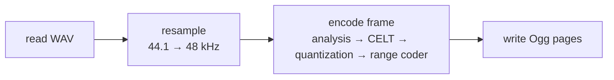
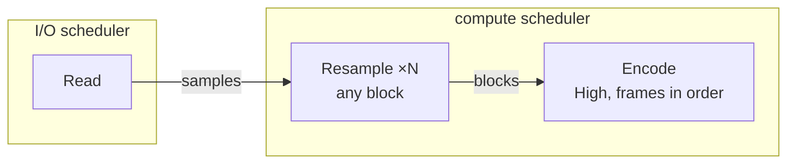
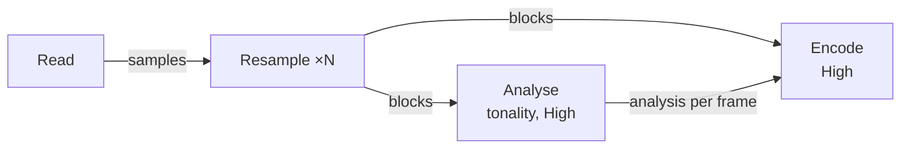
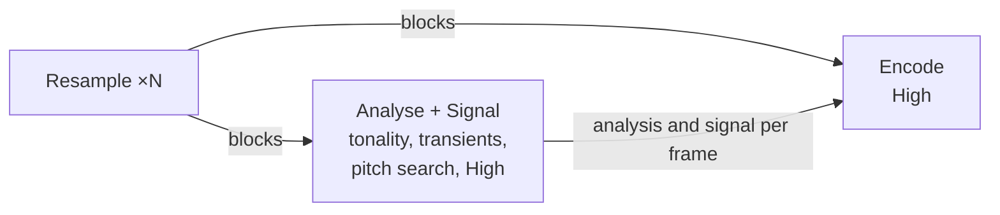

# How ctOpus's task graph grew

ctOpus did not start parallel. It started as a faithful copy of opusenc, ported function by function,
and was then taken apart step by step, each step measured and checked byte for byte against opusenc.
This page shows the task graph after each step: what changed, why, and what it gave.

[← back to the README](../README.md)

**Three series of numbers.** All of them use the same test file (254 seconds of 44.1 kHz stereo music,
128 kbit/s) on an Intel Core i9-11900K with 16 threads, and measure the whole process (reading,
resampling, encoding, writing). Only numbers within one series compare:

| Series | Steps | How it was measured |
|---|---|---|
| **A** | 0 to 2 | median of 5 runs per variant, one variant after the other |
| **B** | 3 to 8 | all variants interleaved in one run; on some days the machine was 10 to 15 % slower, so opusenc always ran in the same run as the yardstick |
| **C** | 8 | the published benchmark: 343 music files, 45 hours, three PCs |

| Shape | Meaning |
|---|---|
| box | a task |
| box ×N | one task per compute thread, all doing the same kind of work |
| arrow | an edge: samples, blocks of resampled audio, the frames of the analysis chain, work handed over |
| dotted arrow | a way back: a correction or a cancellation |
| **High** | a serial task that takes the frames in order, with high priority |

---

## 0 · The reference: opusenc

One thread does everything in turn. Every frame continues where the frame before it left off: the
range coder, the energy prediction, the bit reservoir, the filter memories. A frame cannot start
before the one before it is done. One core works, the others wait.

These bytes are the yardstick: every later step writes exactly the same `.opus` file.

**Result (A):** `--comp 10` 2.16 s, `--comp 0` 0.97 s. ctOpus on one thread, the same encoder ported
to C++, is as fast: 2.09 s and 0.94 s.

---

## 1 · Reading and resampling in parallel

**Change:** the resampler becomes a parallel stage. Read hands out blocks of 16 384 output samples as
soon as their input is there; any worker computes any block; Encode takes them in order.

**Why:** resampling was the largest single cost of opusenc. Each output sample of its resampler is
one dot product whose filter phase follows from the sample's index alone, so blocks can be computed
independently and give the very same floats, summed in the order of the SSE code opusenc uses.

**Result (A):** `--comp 10` 1.86 s (1.16× opusenc), `--comp 0` 0.70 s (1.38×). The resampler has
left the critical path; what remains is the serial encoder.

---

## 2 · An analysis chain runs ahead

**Change:** the tonality analysis of each frame moves to a task of its own, which reads the same
blocks and runs ahead of Encode.

**Why:** the analysis depends only on the audio and on the schedule of the frames, never on the
encoder's decisions. The chain replays exactly the sequence of calls opusenc makes, keeps a history,
so nothing Encode still reads is overwritten, and stays at most 200 frames ahead.

**Result (A):** `--comp 10` 1.73 → 1.52 s. Encode no longer waits for anything; what remains is
serial work.

---

## 3 · The signal stage moves into the chain

**Change:** the chain also computes the part of the CELT encoder that depends only on the signal:
pre-emphasis, tone and transient detection, pitch search.

**Why:** Encode checks every frame of the chain against its own state byte for byte and only takes
it if it matches exactly. If the chain ever runs apart (a reset, a speech frame), Encode is slower,
never wrong. On the test file it took 12 725 of 12 725 frames.

**Result (B):** `--comp 10` 1.47 s against opusenc `--comp 10` 2.38 s in the same run (0.62 of its
time, before 0.74).

---

## 4 · A speculative front part

<picture>
  <source media="(prefers-color-scheme: dark)" srcset="images/step-4-front-dark.svg">
  
</picture>

Rendered with Mermaid's ELK layout; source: [images/step-4-front.mmd](images/step-4-front.mmd).

**Change:** the chain goes further and computes the next frame's front part: pre-filter, MDCT, band
energies, normalisation, time-frequency and spreading decisions.

**Why:** these depend on only a few values of the serial encoder, and those rarely change. The chain
assumes them as they were at the last check. If Encode finds a mismatch, it sends its true state back
(the dotted arrow), and the chain computes again from there.

**Result (B):** 12 724 of 12 725 frames taken. `--comp 10` 1.21 s, then 1.00 s, against opusenc
`--comp 0` 0.97 s in the same run.

---

## 5 · Front on its own, and a helper for the rounding trial

<picture>
  <source media="(prefers-color-scheme: dark)" srcset="images/step-5-theta-dark.svg">
  
</picture>

Rendered with Mermaid's ELK layout; source: [images/step-5-theta.mmd](images/step-5-theta.mmd).

**Change:** the front part becomes a task of its own. A new task, Theta, takes over one of two
trials Encode makes for each stereo band.

**Why:** at high complexity the encoder quantizes every stereo band twice, with the stereo angle
rounded down and up, from the same state, and keeps the cheaper one. The two trials can run at the
same time. A trial takes only one or two microseconds, so both sides wait actively first and only
then sleep.

**Result (B):** `--comp 10` 0.80 s against opusenc `--comp 0` 0.99 s in the same run. **From here on,
ctOpus at maximum complexity is faster than opusenc at minimum complexity.**

---

## 6 · Lighter work for Encode (the graph stays the same)

**Change:** more of what Encode did moves to the chain and to Front: the input stage of each stream
(DC filter, silence, frame energy, stereo width) and the stereo angles of the top level; work that
only served the trials is skipped after the last trial.

**Why:** everything Encode no longer computes shortens the serial chain. Every handover is still
checked for exact equality.

**Result (B):** `--comp 10` 0.70 s against opusenc `--comp 0` 1.02 s and `--comp 10` 2.11 s in the
same run.

---

## 7 · Speculating on the next frame

<picture>
  <source media="(prefers-color-scheme: dark)" srcset="images/step-7-speculate-dark.svg">
  
</picture>

Rendered with Mermaid's ELK layout; source: [images/step-7-speculate.mmd](images/step-7-speculate.mmd).

**Change:** while Encode quantizes frame N, a Speculate task already quantizes frame N+1 on a copy
of the encoder, with what frame N will leave behind guessed. The signal stage moves to a task of its
own, so the chain keeps up.

**Why:** the bands of a frame are coded one after the other, but from one frame to the next only two
small things pass: a few bits left over at the end of the frame, and the state of the range coder
(needed late, if at all). Speculate records every symbol it codes. If all its inputs turn out to be
right, Encode replays the record instead of computing the frame; if not, Speculate stops at the next
band. Encode and Speculate take turns.

**Result (B, on a busy day):** about 96 % of the speculated frames are taken. `--comp 10` 0.70 s
against 0.83 s without speculation in the same run, about 15 % faster.

---

## 8 · Three frames ahead: today's graph

<picture>
  <source media="(prefers-color-scheme: dark)" srcset="images/graph-dark.svg">
  
</picture>

Rendered with Mermaid's ELK layout; source: [images/graph.mmd](images/graph.mmd).

**Change:** the speculation becomes a cascade of up to three levels: the copy for frame N+1 builds
the copy for frame N+2 at the same point, and so on. Each level can have its own Theta helper.

**Why:** with enough threads the serial chain can work several frames ahead. Every additional busy
core also lowers the turbo clock of all cores, the serial one included, so each level only pays from
a certain number of threads. Measured, `--comp 10` (B):

| Threads | no speculation | one level | two levels |
|---:|---:|---:|---:|
| 5 | 0.71 s | 0.85 s | 0.96 s |
| 7 | 0.71 s | 0.56 s | 0.61 s |
| 8 | 0.71 s | 0.56 s | 0.53 s |
| 10 | 0.71 s | 0.56 s | 0.46 s |
| 16 | 0.71 s | 0.61 s | 0.53 s |

Three levels give 0.46 to 0.48 s from 8 threads on. Today's rule: no speculation below 7 threads,
one level at 7, three from 8, and Theta helpers for the levels from 12.

**Result:**
- **One file (B):** opusenc `--comp 0` 0.99 s, opusenc `--comp 10` 2.21 s, **ctOpus `--comp 10`
  0.50 s, `--comp 0` 0.31 s.** At maximum complexity ctOpus is twice as fast as opusenc at minimum
  complexity.
- **The corpus (C):** 343 music files, 45 hours, `--comp 10 --bitrate 128`, all files bit-identical:

| PC | opusenc | ctOpus | faster |
|---|---:|---:|---:|
| Intel Core i9-11900K, 8 cores / 16 threads | 1 267 s | 290 s | **4.4×** |
| Intel Xeon E3-1275 v6, 4 / 8 | 1 802 s | 437 s | **4.1×** |
| Intel Core Ultra 7 155H, 16 / 22 (notebook) | 1 400 s | 555 s | **2.5×** |

[← back to the README](../README.md)
